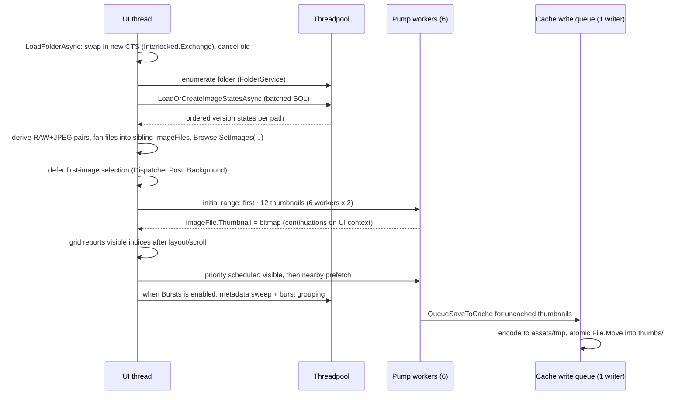

# Happy Photon Architecture

Happy Photon is a desktop photo management and editing app (Avalonia UI, .NET 10) with
an intentionally simple workflow. This document describes the overall structure and
then goes deep on the two most intricate subsystems: **catalog loading** and the
**thumbnail pump**. For day-to-day agent guidance (style, shortcuts, commands), see
[AGENTS.md](../AGENTS.md).

## Process shape

- One process, one window. `Program` acquires `SingleInstanceGuard` before Avalonia
  starts; a second launch exits immediately.
- `AppDataLocationService` owns every application-data root. The default
  catalog remains under Pictures, while regenerable assets use the platform
  cache location:

```
<Pictures>/Happy Photon Catalog/
├── catalog.db              SQLite: image metadata, edit settings, flags, ratings, app settings
├── .catalog-identity       versioned catalog instance GUID
└── presets/                user preset JSON files (PresetService)

<platform cache>/assets/
    ├── .catalog-stamp          catalog GUID + image-id high-water mark
    ├── thumbs/<xx>/<id>.jpg     largest unedited thumbnails, sharded by catalogId % 256
    ├── previews/<xx>/<id>.jpg   cached 1600px previews, same sharding
    ├── rendered-thumbs/<xx>/<id>.jpg  accurate edited RAW thumbnails + metadata sidecars
    └── tmp/                     staging for atomic cache writes; cleared at startup
```

Windows uses `%LOCALAPPDATA%\Happy Photon\cache`, Linux uses
`~/.cache/happy-photon`, and macOS uses `~/Library/Caches/Happy Photon`. The
fixed `locations.json` pointer lives in Local AppData on Windows,
`~/.config/happy-photon` on Linux, and Application Support on macOS. Users can
opt into the platform data root for the catalog. Environment overrides affect
one process and are never written to the pointer.

Every data root carries `.happy-photon-root`. Destructive storage operations
re-check it immediately before acting and remove only known catalog files or
cache tiers. Opening is not destructive: a pointer-designated root whose marker
went missing (a backup restore, a downgraded-build run) is re-marked on open,
while a marker with foreign contents still refuses. Existing Pictures catalogs with `assets/` are adopted as legacy
co-located pairs without moving bytes. Without `assets/`, pointer-loss adoption
always restores the split layout.

## Layering (MVVM)

| Layer | Location | Rules |
|---|---|---|
| Models | `Models/` | Plain data + `ObservableObject` state (`ImageFile`, `EditSettings`, …). No I/O. |
| Services | `Services/` | All image/catalog/file logic. Flat folder, focused class names, no UI types except `Avalonia.Media.Imaging.Bitmap` as an output format. |
| ViewModels | `ViewModels/` | `MainWindowViewModel` split into partial files per workflow (`.BrowseLoading`, `.Editing`, `.Folders`, …). Owns commands, debouncing, cancellation. |
| Views | `Views/` | XAML + minimal code-behind (dialogs, pointer handling, panel wiring). |

Key service composition (`ImageService` is a facade, constructed lazily on first use):

```
MainWindowViewModel
 ├── CatalogService                       SQLite runtime ops; CatalogSchema owns DDL/shape validation
 ├── ImageService (facade)
 │    ├── ThumbnailService ── ThumbnailCacheService (unedited source cache)
 │    ├── PreviewService ──── PreviewCacheService + RenderedThumbnailCacheService
 │    │    └── PreviewBaseCoordinator ── BaseLoaderRouter
 │    ├── HistogramService
 │    ├── MetadataService                           (single-flight extraction + UI apply)
 │    ├── SourceAvailabilityService + SourceHydrationService
 │    ├── RenderPipeline                            (shared preview/export edit math)
 │    ├── ImageExportService ── GatedBaseImageLoader + RenderPipeline
 │    │                         + ExportMetadataService
 │    └── IRawProcessingService                     (thumbnails + metadata only)
 ├── FolderService / FolderTreeService              (disk enumeration)
 ├── PresetService, AppSettingsService, FileOperationService
```

`ImageService` exposes its sub-services directly as properties (`Previews`,
`Thumbnails`, `Histograms`, `Metadata`) rather than forwarding their members; the
facade itself keeps only the composed entry points that span sub-services, such as
thumbnail promotion and export.

## Image pipeline

The detailed pipeline documentation starts at
[docs/pipeline/OVERVIEW.md](pipeline/OVERVIEW.md). Preview, export, and edited standard
thumbnails share `RenderPipeline`; RAW cache-miss thumbnails deliberately apply only
`RenderGeometry` to their embedded preview until Develop produces an accurate render.
Source-specific behavior belongs in the loaders. Render-required facts stay on
`BaseImageInfo`; preview-only sensor histogram and source-saturation facts travel in a
generation-matched `PreviewSourceAnalysis` beside the decoded pair. Standard images are
color-normalized and linearized by Magick.NET. RAW images decode through the pinned
LibRaw 0.22.2 runtime through the versioned Happy Photon bridge into the same linear Q16
base contract. It is the only producer of RAW raster pixels: runtime rejection and
per-file decode failure are surfaced instead of routing through Magick. RAW metadata comes from
LibRaw except exposure bias, which LibRaw does not surface and Magick cannot read from
RAW containers; MetadataExtractor reads just that tag, header-only, without decoding.
An optional local DCP replaces only the RAW characterization matrix at the fused import
seam and contributes its HueSat payload before AgX in the shared renderer. Resolution is
availability-gated and binds matrix, tables, typed status, and source/content outcome
token atomically to `BaseImageInfo`. Missing-WB or rejected profile content preserves the
built-in path. No profile ships and no profile operation performs a network read.

Develop mode holds one bounded preview pair plus its source analysis from a single
half-size RAW decode (see the preview pipeline below), retaining that current pair
across a same-image Browse/Develop round-trip; export decodes a fresh
native-resolution base without preview analysis. The
viewer's 100% geometry is anchored to original pixels, but preview detail remains
limited by the large base; zoom beyond that ceiling is not a native-detail RAW
inspection mode. `PreviewArtifacts` carries one render's bitmap, scopes, clipping,
decode capability, profile, white-balance anchor, and sensor histogram facts into a
VM-owned render outcome. The ViewModel applies that outcome atomically only when its
image and synchronously reserved surface generation exactly match the current request;
rejected outcomes dispose their pixels, masks, and uncommitted promotion lease. Clipping masks are requested only
while the Develop overlay is latched or peeked, preserving a mask-free normal preview
path. Camera compatibility follows the bundled LibRaw generation and the exact
compression variant, not merely the file extension. The current product boundary is
global edits: there are no local masks, layered compositing, HDR output, or custom
output profiles.

## Startup sequence

First frame is sacred: nothing non-visual happens before the window is shown. The one
exception is the bounded synchronous read of `window.txt` from the app-data pointer
root: window placement is visual configuration and must be applied before `Show()` to
avoid a visible jump. The file is plain key=value lines so no JSON library loads before
the first frame. Failure silently preserves the centered 1200×700 default.

1. `Program.Main`: single-instance guard, then Avalonia lifetime.
2. `App.OnFrameworkInitializationCompleted`: construct path-free services +
   `MainWindowViewModel`, show `MainWindow`, then post `CompleteStartupAsync` at
   `Background` dispatcher priority.
3. `CompleteStartupAsync` (off the first-frame path):
   - probe native RAW health on a worker thread, publish pending/degraded About state,
     and inject the completed immutable result into both RAW composition branches
     before workspace readiness; a rejection leaves RAW support unavailable until the
     installation is repaired;
   - finish or roll back a pending journaled move, then resolve `locations.json`;
   - branch on an existing catalog signature rather than a configured path. A fresh or
     configured-but-empty install renders the static Welcome step before any SQLite open;
   - after the user confirms Storage, create or claim the selected roots and re-enter
     initialization at the Pictures step. This committed checkpoint prevents root
     creation from running twice;
   - open the shared catalog connection;
   - create tables;
   - run ordered catalog migrations;
   - validate the resulting schema;
   - check and atomically refresh the cache/catalog pairing stamp;
   - bind `PresetService` to the resolved catalog and load user presets.
   - `MainWindow.InitializeApplicationAsync` — load app settings without treating read
     failures as an empty installation, then restore the session, grandfather an
     existing saved browsing root, or prepare an unselected Pictures tree for the
     versioned first-run wizard.

Update discovery is manual-only: the app contacts GitHub only after the user chooses
**Check for updates** on the About tab, off the UI thread; the result is session-only
and shutdown cancels an in-flight check.

The first frame always paints Dark; the appearance picker stays disabled until app
settings load, then the saved `AppTheme` is applied through
`Application.RequestedThemeVariant`. Variant resources use dynamic lookups so the
realized tree repaints in place; missing or invalid theme settings fall back to Dark,
and the Dark-to-saved-theme transition stays off the first-frame path (invariant 6).

The startup gate is present in the first frame and disables workspace controls and
global shortcuts until startup reaches `Ready`. An unreadable or invalid pointer,
including one whose persisted catalog folder is missing, stops at an explicit
quarantine/recovery action; a schema mismatch offers journaled **Set aside and retry**
for both roots when neither is environment-managed; other catalog or settings failures
replace the neutral initializing state with Retry/Close. During an incomplete first
run, shutdown saves preferences only; the browsing root, viewed folder, and completion
version are committed together when the wizard finishes. The forward-only wizard
advances through Welcome, Storage, and Pictures, conditionally offers Lightroom
import, and ends with an explicit choice to start or skip the tour. Its bounded
Windows and macOS detection checks known install locations and shallow local
fixed-drive folders off the UI thread — no reparse-point descendants, remote or
removable volumes, or broad drive scans — and reports at most five catalog candidates
within the shared entry budget.

Choosing **Start tour** starts a session-only workflow tour owned by
`MainWindowViewModel.WorkflowTour`. Its three non-modal coachmarks anchor to stable
Browse and Develop layout points, suspend when the user changes view, and resume when
that view returns. While a coachmark is visible, unrelated stable sections are
de-emphasized at a themed opacity while the active work surface stays fully
interactive, and the Browse empty-state card stays hidden for the tour's lifetime.
Each coachmark carries a decorative, never hit-testable photon trail (plus an opt-in
glow on small target regions) so the step names its target without coordinate tracking
between controls. Tour navigation never changes photograph state, filters, or
selection; its export action opens a zero-selection preview with a prominent
return-to-Browse action instead of an enabled export command.

## The catalog

### Schema

One `images` row per `(file_path, version)`, keyed by autoincrement `id` (the
**catalogId**), with version numbers limited to 1–8 and a case-insensitive unique
constraint on that pair. The canonical row contains the optional `version_label`,
`file_name`, the v3
`edit_settings` JSON document and `edit_version` marker, `flag_state`, `rating`,
`color_label`, `history_position`, and `updated_utc`. `edit_history` stores full,
labeled edit snapshots keyed by `(image_id, seq)`; `app_settings` is a key/value table.
Each image row is an independent interpretation and owns its edits, history, and
assessments; the source file is shared.

`CatalogSchema` creates this shape for new catalogs, runs ordered transactional
migrations recorded by `app_settings.schema_version`, and then validates the required
image columns through `PRAGMA table_info` on every startup. Migration 1 adds the native
`color_label` slot before validation so pre-label catalogs remain readable. Migration 3
backs up the database before rebuilding `images`; existing ids and the autoincrement
high-water mark are preserved because they are cache identity. Migration 4 adds edit
history without back-filling existing image rows.
Extra columns are ignored so catalogs created by recent development builds still open;
missing required columns fail inside startup initialization. The error panel names the
missing columns and offers to set the catalog and paired cache aside together before
Retry. The ownership-checked journal resumes or rolls back if a crash interrupts the
two root renames.

### Location moves and cache identity

Storage changes are staged in Settings and run at the next launch before the shared
catalog connection opens. A catalog move uses a short-lived SQLite connection for
hot-journal recovery, fingerprints row count, identity, and every preset, copies and
verifies the destination, flips `locations.json`, then removes only known source data.
Failure before the pointer flip rolls back wholesale; after the flip, the journal
resumes cleanup. Cache moves rename `assets/` on one volume or abandon it for
regeneration across volumes; cache files are never copied across volumes.

The versioned `.catalog-identity` GUID and `assets/.catalog-stamp` prevent ID-sharded
assets from pairing with a different or rolled-back catalog. A missing stamp on a
nonempty established cache, a GUID mismatch, or an ID high-water regression clears
the known tiers. Legacy adoption receives one trusted bootstrap. The stamp advances
after each single insert or insert batch. A missing cache root self-heals; a missing
catalog root fails startup.

For a row marked v2 or v3, valid JSON is parsed and out-of-range values clamp in
memory. A v2 document materializes an explicit legacy, all-off lens baseline before it
can be saved as v3; new rows use the standard on/on/off lens baseline. A null document,
malformed JSON, or other marker logs once for that image and returns neutral current
settings. Reads never rewrite catalog rows. **Runtime cache validity
comes from asset-file timestamps, never from DB flags** (see caching below).

### The batched-load invariant

The catalog's central design rule: **folder loads never issue per-image queries.**
`LoadOrCreateImageStatesAsync(paths)` does the whole folder in a fixed number of
statements:

1. `LoadImageStatesAsync` — `SELECT … WHERE file_path IN (…)` in batches of 500
   parameters, returning each path's ordered list of `CatalogImageState` versions.
2. Any paths missing from the result are bulk-inserted with multi-row
   `INSERT … ON CONFLICT(file_path, version) DO NOTHING` for V1, 300 rows per statement.
3. If anything was inserted, re-run step 1 to pick up the new ids.

So a 5,000-image folder costs ~10 SELECT batches + inserts on first visit, and ~10
SELECTs (no writes) on every later visit — regardless of how much per-image state
exists. Do not reintroduce loops of `GetOrCreateImageAsync` /
`LoadEditSettingsAsync`-style single-row calls on the folder-load path; that was the
original design and it made folder switches O(n) in DB round trips.

`GetOrCreateImageAsync` still exists for the *single-image* case: lazily assigning a
catalogId the first time an image needs one outside a folder load (e.g. rating a file
that was never cataloged). Callers go through `EnsureCatalogIdAsync`, which no-ops when
`ImageFile.CatalogId != 0` — after a normal folder load that is always true, so the
steady-state cost is zero.

### Write patterns

- **Edit autosave**: slider changes debounce 150 ms, then one transaction writes the
  current JSON document and appends its labeled history snapshot. A divergent or empty
  list first receives an Original snapshot. Rotation clicks commit discretely, horizon
  drags use the slider gesture boundary, and applying crop commits the crop and its
  provisional horizon together. No save occurs per slider tick.
- **Batch paste**: proposed settings are cloned without mutating live models, then one
  catalog transaction reuses a parameterized update for every target. Any missing row
  also appends Paste settings to every target's history. Any missing row rolls back the
  entire batch; models update only after commit. Thumbnail refresh uses
  at most six workers and discards results for images no longer in the browse.
- **Flags, ratings, and color labels**: one set-based JSON-backed `UPDATE` writes every
  target for the user action inside a transaction. A missing target rolls back the set,
  and live models change only after commit.
- **App settings**: multi-key saves share one catalog transaction. First-run completion
  atomically writes both folder paths, the experience version, and current preferences.
- **Deletes**: asset files first, then the row.

### Connection serialization

`CatalogService` holds a **single shared `SqliteConnection`**, and Microsoft.Data.Sqlite
connections are not safe for concurrent use. Callers run on the UI context *and* on
threadpool threads (folder loads are wrapped in `Task.Run` because
Microsoft.Data.Sqlite's async APIs still do synchronous disk work). A service-owned
`SemaphoreSlim` serializes every command and keeps the lease until its reader or
transaction is disposed. Batched folder operations release the gate between SQL
statements so autosaves and direct user actions can make progress. Composite methods
must not acquire an outer lease and then call another gated catalog method because the
gate is intentionally non-reentrant.

WAL mode is intentionally not enabled: the app has one process and one gated
connection, so WAL would add sidecar-file behavior without making catalog operations
concurrent. Revisit this only if the connection model changes.

## Lightroom catalog import

Lightroom import brings ratings, pick/reject flags, and color labels from Lightroom
Classic without opening original photographs. `LightroomCatalogReader` works from a
temporary snapshot outside the Happy Photon catalog. Because read-only SQLite access
can mutate an existing WAL shared-memory sidecar, the verified safe path requires
Lightroom to be fully closed and refuses catalogs with SQLite sidecars; the closed
catalog file is held open for reading while the snapshot is copied. Orphaned snapshot
directories are swept during deferred catalog initialization.

`CatalogImportService` normalizes mapped paths, verifies each mapped file entry exists
without opening its content, and builds a vendor-neutral preview. Missing files never
become catalog rows, and a zero-match preview cannot persist import settings.
`CatalogService.Import` exclusively owns persistence: it revalidates the preview's
per-axis baseline under the connection gate, creates unknown paths, updates `images` and
revisioned `image_assessments`, and persists import settings in one short transaction.
Imported metadata never sets `pending_axes`, so a large import does not enter the bounded
XMP writer. After commit, matching live `ImageFile` objects adopt snapshots only when
their revision still matches the preview baseline, then filters refresh in place.

## XMP sidecars

XMP support is opt-in per catalog. Folder enumeration records `.xmp` files in
the same pass as supported images, while XML parsing begins only after the
thumbnail session has started and runs as cancellable background work.
Reconciliation compares rating, flag, label, and crop independently against the
revisioned `image_assessments` row; catalog revisions and the active browse
generation guard UI adoption. Crop is fill-empty and recency-exempt: a supported
Adobe crop is adopted through ordinary edit history only while persisted and live
geometry are both empty. A file's V1 is the permanent XMP primary: sidecar adoption
and publication target V1 only, while other versions remain catalog-only.

In Read & write mode, only a committed local assessment mutation schedules a
sidecar write. A single background writer coalesces work by target, merges the
changed axes into parsed XML (or the complete assessment tuple for a new
sidecar), revalidates the candidate path, timestamp, and length, then promotes a
temporary file beside the sidecar. Writes use only standard Adobe vocabulary:
`xmp:Rating` always holds the true 0–5 stars, `xmpDM:pick` holds `1`, `0`, or
`-1` for picked, unflagged, or rejected, and `xmpDM:good` accompanies picked and
rejected values for Lightroom Classic interoperability. `xmp:Label=""` is the
explicit label clear. Portable zero-rotation crops use only `crs:HasCrop`, the four
normalized crop edges, and `crs:CropAngle="0"`; every other Camera Raw property is
left untouched. Angled, warp-relative, perspective-corrected, and orientation-
transposed crops are skipped. Reads likewise use only these standard XMP properties,
and new writes never create or update the `happyphoton` namespace. Applications such
as darktable and Bridge that recognize rejects only through `xmp:Rating="-1"`
will not see Happy Photon rejects; preserving the true star rating and
Lightroom-compatible pick state is intentional. Reader and writer loads reject
sidecars larger than 4 MiB. Sidecar availability is checked independently. Crop
interop may perform an availability-gated, header-only EXIF orientation ping on an
original; it never decodes the original or approves cloud hydration.

## Folder load and the thumbnail pump

This is the most concurrency-sensitive flow in the app. The goals, in priority order:

1. **Folder switches stay constant-time on the UI thread** — no per-image UI work, no
   per-image semaphore waiters or cancellation registrations.
2. Visible thumbnails appear before background work starts.
3. A folder switch cleanly cancels the previous folder's work without leaking or
   double-disposing the `CancellationTokenSource`.

### Sequence



### Cancellation ownership protocol

Folder switches are frequent and races here caused real bugs, so ownership is explicit:

- `_thumbnailLoadingCts` is swapped with `Interlocked.Exchange`; the previous CTS is
  only ever **cancelled** by `LoadFolderAsync`, never disposed by it once the pump has
  started.
- **Disposal ownership transfers exactly once**: before the thumbnail session starts,
  `LoadFolderAsync` owns the CTS and disposes it on early failure/cancel. The active
  session then owns the CTS for the folder's lifetime because its six scheduler workers
  remain available for scrolling. Its `finally` uses `CompareExchange` so an older
  session can never clear a newer folder's state.
- Workers observe cancellation cooperatively; an in-flight decode may finish after
  cancel. A monotonically increasing folder generation rejects that result and disposes
  its bitmap instead of assigning into stale state. Browse replacement, removal, and
  shutdown also dispose resident bitmaps deterministically.

### The pump

The first `2 × workers` visible Browse images are loaded by `LoadThumbnailRangeAsync`,
whose six workers pull indices from a shared `Interlocked` counter. Paired RAW paths
are excluded while the stored Pairs preference is on; disabling it adds those files
to visibility-driven scheduling without another catalog read. This preserves a fast first
paint before metadata analysis begins. A Large request stages this burst at Small
quality, then queues the requested Large follow-up. After that, one
`ThumbnailLoadScheduler` owns exactly six long-lived workers for the active folder:

Develop and full-screen close a shared admission gate before preview work starts. Up to
six source reads already admitted by the initial range or scheduler may finish, while
queued visible-first work remains pending and resumes when Browse becomes active.
Paused pump work is excluded from status activity; direct thumbnail operations remain
visible, and resuming the pump re-arms the activity sampler.

- `BrowseGridView` derives visible indices from the scroll offset and grid geometry.
- The ViewModel adds one viewport of nearest-first prefetch on each side, capped at 128
  images. Visible entries have higher priority than prefetch entries. Queued smaller
  requests are superseded, while a larger request arriving behind an in-flight smaller
  request is retained as its follow-up.
- Active-browse ownership is checked through a reference-identity set, keeping each
  completed assignment O(1). A terminal decode failure is remembered on that folder's
  `ImageFile`, so viewport reports do not retry corrupt or unsupported files and any
  last successful resident bitmap remains visible; a fresh folder load creates new
  instances and permits a new attempt.
- A cloud deferral is distinct from a decode failure: it is remembered for the current
  folder generation, is not re-enqueued by viewport reports, and does not reserve a
  residency slot. When a usable bitmap is already resident, a failed or
  hydration-deferred larger request is recorded only against that generation target
  and neither changes the base cloud badge/count nor retries while the bitmap remains
  resident; residency eviction removes that constraint, so viewport re-entry may
  reload.
- Workers wait on one shared signal, not one semaphore waiter or cancellation
  registration per image. Folder switches remain constant-time on the UI thread.
- Capture-time metadata is not swept on folder open. Enabling Bursts starts a
  cancellable, serial sweep over the current folder and computes burst groups over
  logical captures — a singleton or a path-derived RAW+JPEG pair with the same
  case-insensitive basename in the same directory; disabling Bursts or changing
  folders stops the remaining work. The pairing preference persists in `app_settings`;
  burst size and index count shutter presses while membership remains available for
  every file. The shared
  background segment reports processed/total progress while analysis is active.
  `MetadataService` deduplicates this work with selection-triggered loads and awaits
  UI application before grouping reads `DateTaken`. The sweep analyzes locally
  readable images and reports cloud-only images as skipped; enabling Bursts never
  approves hydration.
- Browse derives the same basename RAW+JPEG groups from distinct physical paths.
  Pairing hides every version of the RAW path and badges every JPEG version; visibility,
  file-type filtering, navigation, selection, counts, bursts, and thumbnail scheduling
  then operate on the capture tiles. Pair assessments fan out to both primary catalog
  rows, while Develop may transiently display the hidden RAW through the same per-file
  preview path. Deletion recomputes the path-derived groups.

Worker continuations post back to the UI context (the pump is started from the UI
thread), so `ImageFile.Thumbnail` assignments — and the resulting grid updates — happen
on the UI thread. Decoded residency is capped at 64 MiB by actual BGRA byte count;
pending UI-thread bitmap retirement also counts against admission, with an 8 MiB
prefetch safety margin. Visible and selected images are pinned; the
least-recently-visible unpinned bitmaps are cleared and retired before new requests are
admitted. The disk cache remains the long-lived store, so revisiting an evicted range is
a cheap decode rather than source-image processing.

### Per-image thumbnail resolution (ThumbnailService)

Each request carries a minimum acceptable long edge and a fresh-generation long edge:
Small `(150, 150)`, Medium `(150, 192)`, or Large `(512, 512)`. A warm cache is checked
first: satisfactory larger entries decode down to at most the generation target, and
undersized entries paint immediately while an allowed source upgrade is queued. Cache
writes are largest-wins for the current source version, so late Small work cannot
replace a Large entry.

On a cache miss, source candidates are tried in this order:

1. RAW only — **LibRaw embedded preview** (`ExtractThumbnail`), with manual EXIF
   orientation when LibRaw output lacks it. A preview whose aspect differs by more
   than 3% from the visible RAW frame LibRaw reports is center-cropped toward that
   aspect (camera-added padding); at or below 3%, or when visible geometry is
   unavailable, the preview is preserved.
2. **EXIF thumbnail** via `Ping` (header-only read), accepted only if its aspect ratio
   matches the source within 3% (`ExifThumbnailDecoder`); unlike LibRaw previews,
   missing geometry or a larger mismatch rejects it.
3. RAW only — **embedded JPEG scan** (`EmbeddedJpegExtractor`): scan the raw bytes for
   `FFD8…FFD9` spans, validate candidates with Magick, pick the largest, trying the
   *last* `FFD9` marker first (some vendors nest JPEGs). Results are memoized in a
   short-lived static cache to dedupe parallel workers; not aspect-normalized.
4. **Reduced-size decode for non-RAW files** — for JPEGs, `JpegThumbnailDecoder` uses
   Avalonia's platform decoder (`Bitmap.DecodeToWidth/Height`) plus a manual
   orientation pixel-remap; other standard formats go through Magick with size hints.
   RAW files never enter this step.

RAW extraction retains the best safe embedded candidate and continues while it is
below the generation target. It returns immediately at that target, otherwise returns
the best candidate after all safe sources are exhausted. Browse loading never starts a
full RAW demosaic to satisfy Large.

Edited standard images keep the low-resolution `RenderPipeline` path, which mirrors
`StandardBaseLoader`. Edited RAWs use a different speed-first order: an in-memory
thumbnail from the matching accepted Develop render, a matching
`assets/rendered-thumbs/` entry, then the unedited source thumbnail with only rotation,
horizon rotation, and crop applied — the fallback never applies tone or color to the
camera-rendered embedded JPEG and never upscales a crop. Folder loading never decodes a
RAW base or a 1600px preview. The unedited source thumbnail remains unchanged in
`assets/thumbs/`. Rendered-thumbnail cache format, validity, and largest-wins rules are
specified in [docs/pipeline/DECODE.md](pipeline/DECODE.md) §5.

### Cloud-file source access

Folder enumeration captures a display-only availability hint without opening image
content; every actual source access rechecks the current file attributes through
`ISourceAvailabilityService`, because a provider may dehydrate a file after
enumeration.

`SourceReadIntent.Background` is used by thumbnails, metadata, previews, Bursts, and
unconfirmed export work. It permits local and unknown sources but
returns a typed deferral for files that require hydration; warm Happy Photon caches
are checked before this gate and remain usable. `GatedBaseImageLoader` wraps both
default and injected base loaders, while metadata and path-based statistics gate
their own source entry points.

Only two user actions grant `UserApprovedHydration`: **Download and open** for one
selected image, and the Export workspace after it reports the immutable job's exact
cloud-file count and logical size. Both paths recheck live availability.

### The cache write queue (ThumbnailCacheService)

Persisting thumbnails must never slow down rendering them, so writes are decoupled:

- `QueueSaveToCache` clones the bitmap (pixel copy) and enqueues a `CacheWrite` into a
  **bounded channel (256 entries, drop-oldest)** — a full queue sheds the oldest write
  rather than blocking a worker or growing memory; dropped/failed entries dispose
  their bitmap.
- A **single background writer** drains the channel: encode to a GUID-named JPEG in
  `assets/tmp/`, verify the source file's mtime hasn't changed since capture
  (staleness guard), then atomically `File.Move` into place. Old PNG bytes stored
  under `.jpg` names remain readable and are re-encoded lazily. Failures clean up the
  temp file; startup clears any orphans left by a crash.
- **Shutdown**: the channel is completed and drained for at most 2 seconds; after that
  the writer is cancelled and pending entries are dropped, so a slow disk can never
  block window close. Losing queued cache writes is safe — they regenerate next visit.

### Why cache validity is file-timestamp based

Earlier designs tracked `has_thumbnail`/`has_preview` in the DB, which meant DB writes
on the image-loading path and a second source of truth that could drift from the files
on disk. The current rule — *cache file exists and is newer than the source* — needs no
DB access, survives crashes mid-write (temp + atomic move), and self-heals if a user
touches originals or deletes the assets folder.

## Preview pipeline (Develop mode)

Briefly, for contrast with thumbnails. The authoritative pipeline behavior lives in
the pipeline docs: decode contract, base-pair ownership, and disk caches in
[docs/pipeline/DECODE.md](pipeline/DECODE.md) (§4–5); render stages, budgets, resting
renders, and rendered-thumbnail ownership in
[docs/pipeline/RENDER.md](pipeline/RENDER.md) (§11 is the performance contract). The
threading and ownership view:

- `PreviewService` keeps one current preview-base pair (immutable linear 1600px
  interactive + at-most-3200px large) and generation-matched source analysis with
  separate lease/retirement lifetimes;
  decodes are single-flight by identity and newest-wins, and slider edits render only
  from the 1600 base. Camera-profile selection is part of decode identity, so matrix
  and HueSat tables switch together and stale-base renders are non-promotable. A
  same-image Browse/Develop round-trip retains this one pair; selection/path,
  availability, folder, decode-identity, and shutdown invalidation retire it.
- Warm cached previews and rendered thumbnails may paint immediately as last-known
  stale state; a background base decode and fresh render confirm or replace them.
  A settings-matched rendered preview derives its display histogram, waveform, and
  display-floor clipping from the same cached BGRA buffer; a mismatch remains
  bitmap-only. Painting either cache outcome never opens an embedded profile or
  hydrates a source, and availability is rechecked immediately before every profile
  content open.
- After a settled Develop paint, a capacity-one speculative worker may render the one
  uncached local neighbor in the current travel direction. Standard images arm after
  75 ms without selection, edit, crop, filter, folder, or mode activity. It never joins
  the current
  base coordinator or outcome channel: its base pair is disposed after rendering and
  its single encoded handoff is consumed by the settings-matched cached-outcome path.
  Selection cancels in-flight work without blocking the UI. If native cancellation is
  still draining when the current neighbor is armed, the VM retries that latest-owned
  neighbor when capacity frees; edits, availability, folder/view changes, and shutdown
  invalidate the retry.
- Develop has one VM-owned render-outcome channel. Selection and availability changes
  synchronously advance its generation and clear the surface; state-defining renders
  publish bitmap, histogram/waveform, clipping, capability, profile, as-shot WB, and
  RAW histogram together. A matching cached paint atomically publishes bitmap plus
  display scopes and display-floor clipping, while mismatched cached and resting paints
  are bitmap-only upgrades. Cached outcomes never claim source-saturation or RAW facts,
  and a rejected outcome cannot promote a rendered thumbnail or arm a resting render. A
  stale-base render whose own base refresh already painted the same generation fresh
  reports success without painting, so the edit it carries still autosaves.
- An accepted edited RAW render hands ownership to a tracked background
  resize/conversion task for the ≤512px Browse thumbnail — no full-size clone;
  `PreviewService` retains the result strongly and queues it to the independent
  rendered-thumbs writer on promotion or image/view leave. Shutdown waits for tracked
  candidate and queue work before draining that writer. Rendered-cache writes happen
  on image/view leave, never per slider settle.
- Resting (viewport-resolution) renders are display-only: they never advance the
  interactive render generation and never feed histograms, rendered thumbnails, or
  the q90 preview cache; edits cancel them through the preview-debounce token, and
  selection or mode changes retire them. When a resting bitmap replaces the current
  1600 bitmap, ownership of the displaced bitmap moves to `PreviewService` until
  cache promotion or invalidation.
- A RAW preview decode performs one visible-mosaic pass between LibRaw `Unpack` and
  `Process` — row-chunked across parallel workers with bit-identical merged bins,
  completing synchronously on the decode call — releasing the native mosaic lease
  before processing. The optional sensor histogram and source-saturation mask install
  atomically with the pair in its held analysis and are exposed only through the same
  generation's `PreviewBaseLease`; full/export loads skip the pass entirely.
- The ViewModel debounces interaction: preview 150 ms, Browse thumbnail histogram
  300 ms, and thumbnail refresh 500 ms, each with its own CTS. Every Develop
  state-defining render computes the active scope from the same BGRA8 buffer as its
  first paint. Entry paints seed both display scopes; histogram-active ticks skip the
  waveform work, and selecting Waveform schedules a current-generation coherent
  refresh while the prior trace remains visible. Selecting an image starts rendered-cache loading and
  base decoding concurrently. Discovering that the selected original requires
  hydration advances the surface generation and clears even a provisional cache paint;
  fresh decode waits for **Download and open**.
- Export independently re-resolves each selected profile; degraded selections use the
  built-in matrix and propagate a per-image warning.
- Browse mode never loads a 1600px preview just to draw the histogram: the UI thread
  copies the current thumbnail pixels into an independently owned bitmap, and a
  threadpool task scales it to a DPI-independent 150 px bitmap and calculates its
  bins through the same BGRA accumulation path as Develop, without waveform storage.
  Retirement never waits for that work; stale results are rejected by selection and
  thumbnail-generation checks.

### Background activity ownership

The status bar pulls one constant-size activity snapshot at 4 Hz, and only while an
activity epoch is open. It reads worker-owned integer state: the initial thumbnail
batch flag, scheduler desired count, operation-level direct thumbnail tasks, rendered
thumbnail tasks, the complete initial preview task (cached race through first coherent
fresh render), preview decode/refresh/adjacent-warm tasks, cache queues plus writer-in-hand state,
and unique metadata loads. Burst analysis and UI exports contribute one outer
scope per batch, with processed/total progress; metadata remains accounted but is
presentation-suppressed while a burst or export scope already explains it.

Producer and downstream cache-write phases deliberately overlap: a thumbnail or
rendered-thumbnail task enqueues its cache write before leaving its own activity set.
The sampler shows only after 400 ms of continuous work, hides after 600 ms of quiet,
and stops once the hidden, all-zero snapshot has kept the same activity epoch for that
trailing quiet interval; a rendered-thumbnail empty-to-nonempty transition can re-arm
it. This status segment is the only preview-preparation activity surface; Develop has
no histogram-local arming bar.

Shared per-image decode methods do not mutate activity state or notify the UI. Folder
switches register one initial range and a bounded number of operation-level wakes,
independent of folder size; samples never enumerate the Browse, caches, or export
lists. This preserves invariant 3 while keeping property changes bounded to the 4 Hz
sampler.

## Threading model summary

| Work | Where it runs | Coordination |
|---|---|---|
| Folder enumeration, catalog batch load | Threadpool (`Task.Run`) | Folder-load CTS; explicit because Sqlite async APIs still block |
| Initial thumbnail decode | Threadpool, 6 workers | Shared `Interlocked` index; folder generation + CTS |
| Viewport thumbnail decode | Threadpool, 6 workers | Coalescing priority queue; folder generation + CTS |
| `ImageFile.Thumbnail` assignment | UI context (worker continuations) | — |
| Thumbnail cache writes | Dedicated writer task | Bounded channel, drop-oldest; 2 s shutdown drain |
| Rendered preview cache writes | Dedicated writer task | On image leave; JPEG + hash sidecar; bounded drop-oldest; atomic move; 2 s drain |
| Rendered RAW thumbnail writes | Dedicated writer task | Independent capacity-8 queue; q85 JPEG + versioned metadata; promotion or image leave |
| Metadata extraction | Threadpool | Per-`ImageFile` single-flight task; selection loads drain during ViewModel teardown |
| Metadata apply + burst grouping | UI thread | Demand-driven by Bursts; cancelled on disable or folder change |
| Preview base decode | Threadpool | One held base; single-flight by identity; newest-wins generation |
| RAW sensor histogram | Preview decode worker | One visible post-Unpack pass; installed with lease analysis; full/export skip it |
| Preview render | Threadpool | Clone lease from held base; latest render generation wins |
| Resting preview render | Threadpool, at most 2 managed workers | Parent interactive generation + decode key + resting serial; edit token cancels |
| Adjacent preview warm | Long-running background task, capacity one | Settled Develop paint; cancel-and-drop replacement semantics; one encoded cache handoff |
| Display histogram + waveform | Preview render worker, at most 2 managed workers | Exact preview BGRA8 buffer; bounded row-parallel accumulation; histogram ticks skip inactive waveform accumulation |
| Browse histogram | UI pixel copy, threadpool calculation | Independent source clone; bounded 150px scale; selection/thumbnail-generation checks |
| All catalog SQL | Caller's context | Service-owned gate around the shared connection |
| Develop-subject history load | Threadpool (`Task.Run`) | Subject generation; load publishes before a waiting edit append |
| Explicit source hydration | Threadpool stream read | Single image or confirmed export batch; cancellation is best effort |

## Design invariants (do not break)

1. Original image files are never modified; exports refuse targets colliding with any
   loaded original (`ExportSafety`).
2. Folder loads make a constant number of DB statements — no per-image query loops.
3. Folder switches do constant work on the UI thread; heavy work is cancelled, not
   awaited.
4. Cache validity is decided by asset-file timestamps, never by DB flags.
5. Thumbnail and preview cache writes are atomic (temp file + move) and shed load
   rather than block interactive work.
6. First frame ships before catalog/preset/folder initialization starts.
7. Decoded thumbnails are viewport-prioritized and capped; the full folder must not be
   retained in native bitmap memory.
8. Every source file stays under 500 lines.
9. Background work never hydrates a cloud-only original. Source reads enforce live
   availability; only a clearly scoped user action may use approved hydration intent.
10. Progress indicators are indeterminate only while their represented work is active.
    Hidden indeterminate FluentTheme ProgressBars animate anyway and keep the
    compositor rendering — they were the entire measured idle CPU/GPU load — so bars
    bind `IsIndeterminate` to their busy flag and browse tiles use a static loading
    placeholder, keeping idle usage at the empty-window floor.
11. Interactive preview ticks stay on the pre-derived 1600 base. Viewport-resolution
    work begins only after a current 1600 paint and never enters histogram/cache
    paths; the 3200 cap and current-image-only pair ownership bound its memory peak.
