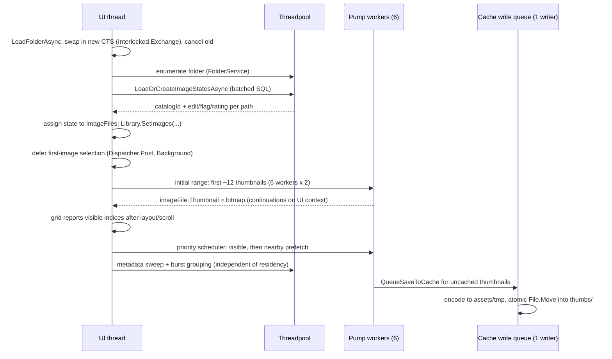

# Happy Photon Architecture

Happy Photon is a desktop photo management and editing app (Avalonia UI, .NET 10) inspired
by Lightroom but intentionally small. This document describes the overall structure and
then goes deep on the two most intricate subsystems: **catalog loading** and the
**thumbnail pump**. For day-to-day agent guidance (style, shortcuts, commands), see
[AGENTS.md](../AGENTS.md).

## Process shape

- One process, one window. `Program` acquires `SingleInstanceGuard` before Avalonia
  starts; a second launch exits immediately.
- The optional agent (MCP) server runs *inside* the GUI process when toggled on, bound
  to `127.0.0.1:7326` behind a persisted token path. It never returns image pixels.
- All persistent state lives under `~/Pictures/Happy Photon Catalog/`:

```
Happy Photon Catalog/
├── catalog.db              SQLite: image metadata, edit settings, flags, ratings, app settings
├── presets/                user preset JSON files (PresetService)
└── assets/
    ├── thumbs/<xx>/<id>.jpg     cached 150px thumbnails, sharded by catalogId % 256
    ├── previews/<xx>/<id>.jpg   cached 1600px previews, same sharding
    └── tmp/                     staging for atomic cache writes; cleared at startup
```

## Layering (MVVM)

| Layer | Location | Rules |
|---|---|---|
| Models | `Models/` | Plain data + `ObservableObject` state (`ImageFile`, `EditSettings`, …). No I/O. |
| Services | `Services/` | All image/catalog/file logic. Flat folder, focused class names, no UI types except `Avalonia.Media.Imaging.Bitmap` as an output format. |
| ViewModels | `ViewModels/` | `MainWindowViewModel` split into partial files per workflow (`.LibraryLoading`, `.Editing`, `.Folders`, …). Owns commands, debouncing, cancellation. |
| Views | `Views/` | XAML + minimal code-behind (dialogs, pointer handling, panel wiring). |

Key service composition (`ImageService` is a facade, constructed lazily on first use):

```
MainWindowViewModel
 ├── ICatalogService (CatalogService)     SQLite runtime ops; CatalogSchema owns DDL/migrations
 ├── ImageService (facade)
 │    ├── ThumbnailService ── ThumbnailCacheService (disk cache + write queue)
 │    ├── PreviewService ──── PreviewCacheService   (disk cache + write queue)
 │    ├── HistogramService
 │    ├── MetadataService                           (single-flight extraction + UI apply)
 │    ├── EditApplicationService                    (Magick.NET edit pipeline)
 │    ├── ImageExportService
 │    └── IRawProcessingService                     (LibRaw on Win/Linux, Magick.NET on macOS)
 ├── FolderService / FolderTreeService              (disk enumeration)
 ├── PresetService, AppSettingsService, FileOperationService
 └── McpServerHost → AgentToolService → MainWindowViewModel.Agent   (three-layer agent stack)
```

## Startup sequence

First frame is sacred: nothing non-visual happens before the window is shown.

1. `Program.Main`: single-instance guard, then Avalonia lifetime.
2. `App.OnFrameworkInitializationCompleted`: construct `CatalogService` +
   `MainWindowViewModel`, show `MainWindow`, then post `CompleteStartupAsync` at
   `Background` dispatcher priority.
3. `CompleteStartupAsync` (off the first-frame path):
   - `CatalogService.InitializeAsync` — create directories, clear `assets/tmp/`
     orphans, open the SQLite connection, run `CatalogSchema` DDL + column migrations.
   - `PresetService.InitializeAsync` — load built-in + user presets.
   - `MainWindow.RestoreSessionAsync` — load app settings from `app_settings`, restore
     the folder tree root and selected folder (which triggers the first folder load),
     restore agent-server state.

## The catalog

### Schema

One `images` row per known file, keyed by autoincrement `id` (the **catalogId**) with a
`UNIQUE COLLATE NOCASE` `file_path`. The row holds *all* per-image persistent state
inline: edit settings (exposure…highlights as columns, crop/curve as JSON text),
`applied_preset_id`, `flag_state`, `rating`, `updated_utc`. `app_settings` is a
key/value table. Column migrations use additive `ALTER TABLE … ADD COLUMN` operations
guarded by `PRAGMA table_info`. Startup also drops two obsolete named path indexes;
the `UNIQUE COLLATE NOCASE` constraint already owns the required auto-index.

Older catalogs may retain `has_thumbnail` / `has_preview` columns, but new catalogs do
not create them. **Runtime cache validity comes from asset-file timestamps, never from
the DB** (see caching below). Avoid a table rebuild solely to remove legacy columns.

### The batched-load invariant

The catalog's central design rule: **folder loads never issue per-image queries.**
`LoadOrCreateImageStatesAsync(paths)` does the whole folder in a fixed number of
statements:

1. `LoadImageStatesAsync` — `SELECT … WHERE file_path IN (…)` in batches of 500
   parameters, returning `CatalogImageState` (catalogId, edit settings, flag, rating)
   keyed by path (case-insensitive).
2. Any paths missing from the result are bulk-inserted with multi-row
   `INSERT … ON CONFLICT(file_path) DO NOTHING`, 300 rows per statement.
3. If anything was inserted, re-run step 1 to pick up the new ids.

So a 5,000-image folder costs ~10 SELECT batches + inserts on first visit, and ~10
SELECTs (no writes) on every later visit — regardless of how much per-image state
exists. Do not reintroduce loops of `GetOrCreateImageAsync` /
`LoadEditSettingsAsync`-style single-row calls on the folder-load path; that was the
original design and it made folder switches O(n) in DB round trips.

`GetOrCreateImageAsync` still exists for the *single-image* case: lazily assigning a
catalogId the first time an image needs one outside a folder load (e.g. rating a file
that was never cataloged). Callers go through `EnsureCatalogIdAsync`, which no-ops when
`ImageFile.CatalogId != 0` — after a normal folder load that is always true, so the
steady-state cost is zero.

### Write patterns

- **Edit autosave**: slider changes debounce 150 ms, then one `UPDATE images SET …`
  covering all edit columns. No save per slider tick.
- **Batch paste**: proposed settings are cloned without mutating live models, then one
  catalog transaction reuses a parameterized update for every target. Any missing row
  rolls back the entire batch; models update only after commit. Thumbnail refresh uses
  at most six workers and discards results for images no longer in the library.
- **Flags/ratings**: one `UPDATE` per user action.
- **App settings**: five upserts on shutdown (and on explicit persist points).
- **Deletes**: asset files first, then the row.

### Connection serialization

`CatalogService` holds a **single shared `SqliteConnection`**, and Microsoft.Data.Sqlite
connections are not safe for concurrent use. Callers run on the UI context *and* on
threadpool threads (folder loads are wrapped in `Task.Run` because
Microsoft.Data.Sqlite's async APIs still do synchronous disk work). A service-owned
`SemaphoreSlim` serializes every command and keeps the lease until its reader or
transaction is disposed. Batched folder operations release the gate between SQL
statements so autosaves and direct user actions can make progress. Composite methods
must not acquire an outer lease and then call another gated catalog method because the
gate is intentionally non-reentrant.

WAL mode is intentionally not enabled: the app has one process and one gated
connection, so WAL would add sidecar-file behavior without making catalog operations
concurrent. Revisit this only if the connection model changes.

## Folder load and the thumbnail pump

This is the most concurrency-sensitive flow in the app. The goals, in priority order:

1. **Folder switches stay constant-time on the UI thread** — no per-image UI work, no
   per-image semaphore waiters or cancellation registrations.
2. Visible thumbnails appear before background work starts.
3. A folder switch cleanly cancels the previous folder's work without leaking or
   double-disposing the `CancellationTokenSource`.

### Sequence



### Cancellation ownership protocol

Folder switches are frequent and races here caused real bugs, so ownership is explicit:

- `_thumbnailLoadingCts` is swapped with `Interlocked.Exchange`; the previous CTS is
  only ever **cancelled** by `LoadFolderAsync`, never disposed by it once the pump has
  started.
- **Disposal ownership transfers exactly once**: before the thumbnail session starts,
  `LoadFolderAsync` owns the CTS and disposes it on early failure/cancel. The active
  session then owns the CTS for the folder's lifetime because its six scheduler workers
  remain available for scrolling. Its `finally` uses `CompareExchange` so an older
  session can never clear a newer folder's state.
- Workers observe cancellation cooperatively; an in-flight decode may finish after
  cancel. A monotonically increasing folder generation rejects that result and disposes
  its bitmap instead of assigning into stale state. Library replacement, removal, and
  shutdown also dispose resident bitmaps deterministically.

### The pump

The first `2 × workers` images are loaded by `LoadThumbnailRangeAsync`, whose six
workers pull indices from a shared `Interlocked` counter. This preserves a fast first
paint before metadata analysis begins. After that, one `ThumbnailLoadScheduler` owns
exactly six long-lived workers for the active folder:

- `LibraryGridView` derives visible indices from the scroll offset and grid geometry.
- The ViewModel adds two viewports of prefetch on each side. Visible entries have higher
  priority than prefetch entries; duplicate requests are coalesced.
- Active-library ownership is checked through a reference-identity set, keeping each
  completed assignment O(1). A terminal decode failure is remembered on that folder's
  `ImageFile`, so later viewport reports do not retry corrupt or unsupported files and
  any last successful resident bitmap remains visible. A fresh folder load creates new
  instances and permits a new attempt.
- Workers wait on one shared signal, not one semaphore waiter or cancellation
  registration per image. Folder switches remain constant-time on the UI thread.
- The metadata sweep walks every image independently, computes burst groups, and does
  not require thumbnails to be resident. `MetadataService` deduplicates this work with
  selection-triggered loads and awaits UI application before grouping reads `DateTaken`.

Worker continuations post back to the UI context (the pump is started from the UI
thread), so `ImageFile.Thumbnail` assignments — and the resulting grid updates — happen
on the UI thread. Decoded residency is capped at 512 images. Visible, prefetched, and
selected images are pinned; the least-recently-visible unpinned bitmaps are cleared and
disposed before new requests are admitted. The disk cache remains the long-lived store,
so revisiting an evicted range is a cheap decode rather than source-image processing.

### Per-image thumbnail resolution (ThumbnailService)

For each image, in order, first hit wins (target size 150 px):

1. **Disk cache** — valid iff `assets/thumbs/<xx>/<id>.jpg` exists and its mtime is
   newer than the source file's. No DB involved.
2. RAW/HEIC only — **LibRaw embedded thumbnail** (`ExtractThumbnail`), with manual EXIF
   orientation when LibRaw output lacks it.
3. **EXIF thumbnail** via `Ping` (header-only read), accepted only if its aspect ratio
   matches the source within 3% (`ExifThumbnailDecoder`).
4. RAW only — **embedded JPEG scan** (`EmbeddedJpegExtractor`): scan the raw bytes for
   `FFD8…FFD9` spans, validate candidates with Magick, pick the largest. Uses the
   *last* `FFD9` marker first (some vendors nest JPEGs). Results are memoized in a
   short-lived static cache to dedupe parallel workers.
5. **Reduced-size decode** — for JPEGs, `JpegThumbnailDecoder` uses Avalonia's platform
   decoder (`Bitmap.DecodeToWidth/Height`) plus a manual orientation pixel-remap; other
   formats go through Magick with size hints. Magick remains the fallback for anything
   corrupt or unsupported.

If the image has edits, the *unedited* base thumbnail (cached or fresh) is then run
through `EditApplicationService` using a direct BGRA-to-Magick conversion so the grid
reflects the edit state without a PNG encode/decode round trip. Only the unedited base
is ever written to the disk cache.

### The cache write queue (ThumbnailCacheService)

Persisting thumbnails must never slow down rendering them, so writes are decoupled:

- `QueueSaveToCache` clones the bitmap (pixel copy) and enqueues a `CacheWrite` into a
  **bounded channel (256 entries, drop-oldest)** — a full queue sheds the oldest write
  rather than blocking a worker or growing memory. Dropped/failed entries dispose their
  bitmap.
- A **single background writer** drains the channel: encode to a GUID-named file in
  `assets/tmp/` as an explicit JPEG from directly imported BGRA pixels, verify the
  source file's mtime hasn't changed since capture (staleness guard), then atomically
  `File.Move` into place. Old PNG bytes stored under `.jpg` names remain readable and
  are re-encoded lazily when accessed. Failures clean up the temp file; startup clears
  any orphans left by a crash.
- **Shutdown**: the channel is completed and drained for at most 2 seconds; after that
  the writer is cancelled and pending entries are dropped, so a slow disk can never
  block window close. Losing queued cache writes is safe — they regenerate next visit.

### Why cache validity is file-timestamp based

Earlier designs tracked `has_thumbnail`/`has_preview` in the DB, which meant DB writes
on the image-loading path and a second source of truth that could drift from the files
on disk. The current rule — *cache file exists and is newer than the source* — needs no
DB access, survives crashes mid-write (temp + atomic move), and self-heals if a user
touches originals or deletes the assets folder.

## Preview pipeline (Develop mode)

Briefly, for contrast with thumbnails:

- `PreviewService` keeps **one decoded 1600px `MagickImage` in memory** (the current
  image), guarded by a `SemaphoreSlim`. Slider edits clone this cached base and apply
  edits to the clone (`ApplyEditsToPreviewAsync`) — no re-decode per tick.
- The 1600px base is also cached on disk (`assets/previews/`), same timestamp-validity
  rule as thumbnails. A bounded drop-oldest queue owns JPEG encoding and atomic disk
  writes, so the preview gate covers only base-image identity and cloning, never disk
  I/O. Queued writes re-check the source timestamp before moving into place.
- The ViewModel debounces interaction: preview 150 ms, histogram 300 ms (deferred so
  sliders stay responsive), thumbnail refresh 500 ms, each with its own CTS.
- Selecting an image shows the 150px thumbnail as an instant placeholder, loads the
  preview without a histogram first, then schedules the histogram.
- Library mode never loads a 1600px preview just to draw the histogram. It reads the
  already edited 150px thumbnail directly; if that thumbnail is still loading, its UI
  assignment reschedules the debounced histogram.

## Threading model summary

| Work | Where it runs | Coordination |
|---|---|---|
| Folder enumeration, catalog batch load | Threadpool (`Task.Run`) | Folder-load CTS; explicit because Sqlite async APIs still block |
| Initial thumbnail decode | Threadpool, 6 workers | Shared `Interlocked` index; folder generation + CTS |
| Viewport thumbnail decode | Threadpool, 6 workers | Coalescing priority queue; folder generation + CTS |
| `ImageFile.Thumbnail` assignment | UI context (worker continuations) | — |
| Thumbnail cache writes | Dedicated writer task | Bounded channel, drop-oldest; 2 s shutdown drain |
| Preview cache writes | Dedicated writer task | Bounded channel, drop-oldest; atomic move; 2 s drain |
| Metadata extraction | Threadpool | Per-`ImageFile` single-flight task; no observable mutation |
| Metadata apply + burst grouping | UI thread | Awaited dispatcher application before grouping |
| Preview decode/edit | Threadpool | `_previewCacheGate` semaphore; per-request CTS |
| Library histogram | UI thread after debounce | Direct 150px thumbnail pixel read |
| All catalog SQL | Caller's context | Service-owned gate around the shared connection |
| Agent (MCP) tool calls | ASP.NET worker → marshaled | `AgentToolService` marshals mutations to the UI thread |

## Design invariants (do not break)

1. Original image files are never modified; exports refuse targets colliding with any
   loaded original (`ExportSafety`).
2. Folder loads make a constant number of DB statements — no per-image query loops.
3. Folder switches do constant work on the UI thread; heavy work is cancelled, not
   awaited.
4. Cache validity is decided by asset-file timestamps, never by DB flags.
5. Thumbnail and preview cache writes are atomic (temp file + move) and shed load
   rather than block interactive work.
6. First frame ships before catalog/preset/folder initialization starts.
7. Decoded thumbnails are viewport-prioritized and capped; the full folder must not be
   retained in native bitmap memory.
8. Every source file stays under 500 lines.
