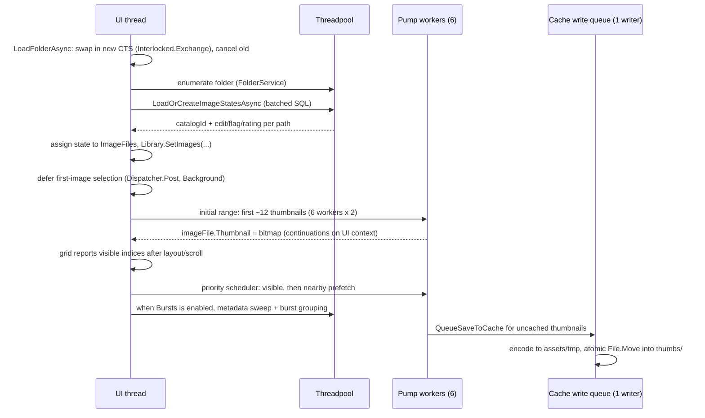

# Happy Photon Architecture

## Lightroom catalog import

Phase 1 imports ratings, pick/reject flags, and color labels from Lightroom Classic
without opening original photographs. `LightroomCatalogReader` works from a temporary
snapshot outside the Happy Photon catalog. Because read-only SQLite access can mutate an
existing WAL shared-memory sidecar, the cross-platform verified safe path requires
Lightroom to be fully closed and refuses catalogs with SQLite sidecars; the closed catalog
file is held open for reading while the snapshot is copied. Orphaned snapshot directories
are swept during deferred catalog initialization.

`CatalogImportService` normalizes mapped paths, verifies each mapped file entry exists
without opening its content, and builds a vendor-neutral preview. Missing files never
become catalog rows, and a zero-match preview cannot persist import settings.
`CatalogService.Import` exclusively owns persistence: it revalidates the preview's
per-axis baseline under the connection gate, creates unknown paths, updates `images` and
revisioned `image_assessments`, and persists import settings in one short transaction.
Imported metadata never sets `pending_axes`, so a large import does not enter the bounded
XMP writer. After commit, matching live `ImageFile` objects adopt snapshots only when
their revision still matches the preview baseline, then filters refresh in place.

## XMP sidecars

XMP support is opt-in per catalog. Folder enumeration records `.xmp` files in
the same pass as supported images, while XML parsing begins only after the
thumbnail session has started and runs as cancellable background work.
Reconciliation compares rating, flag, and label independently against the
revisioned `image_assessments` row; catalog revisions and the active library
generation guard UI adoption.

In Read & write mode, only a committed local assessment mutation schedules a
sidecar write. A single background writer coalesces work by target, merges the
changed axes into parsed XML (or the complete assessment tuple for a new
sidecar), revalidates the candidate path, timestamp, and length, then promotes a
temporary file beside the sidecar. Writes use only standard Adobe vocabulary:
`xmp:Rating` always holds the true 0–5 stars, `xmpDM:pick` holds `1`, `0`, or
`-1` for picked, unflagged, or rejected, and `xmpDM:good` accompanies picked and
rejected values for Lightroom Classic interoperability. `xmp:Label=""` is the
explicit label clear. Reads likewise use only these standard XMP properties, and
new writes never create or update the `happyphoton` namespace. Applications such as
darktable and Bridge that recognize rejects only through `xmp:Rating="-1"` will not
see Happy Photon rejects; preserving
the true star rating and Lightroom-compatible pick state is intentional. Reader and
writer loads reject sidecars larger than 4 MiB. Sidecar availability is checked
independently, and this pipeline never opens the original image.

Happy Photon is a desktop photo management and editing app (Avalonia UI, .NET 10) with an intentionally simple workflow. This document describes the overall structure and
then goes deep on the two most intricate subsystems: **catalog loading** and the
**thumbnail pump**. For day-to-day agent guidance (style, shortcuts, commands), see
[AGENTS.md](../AGENTS.md).

## Process shape

- One process, one window. `Program` acquires `SingleInstanceGuard` before Avalonia
  starts; a second launch exits immediately.
- The optional agent (MCP) server runs *inside* the GUI process when toggled on, bound
  to `127.0.0.1:7326` behind a persisted token path. It never returns image pixels.
- `AppDataLocationService` owns every application-data root. The default
  catalog remains under Pictures, while regenerable assets use the platform
  cache location:

```
<Pictures>/Happy Photon Catalog/
├── catalog.db              SQLite: image metadata, edit settings, flags, ratings, app settings
├── .catalog-identity       versioned catalog instance GUID
└── presets/                user preset JSON files (PresetService)

<platform cache>/assets/
    ├── .catalog-stamp          catalog GUID + image-id high-water mark
    ├── thumbs/<xx>/<id>.jpg     largest unedited thumbnails, sharded by catalogId % 256
    ├── previews/<xx>/<id>.jpg   cached 1600px previews, same sharding
    ├── rendered-thumbs/<xx>/<id>.jpg  accurate edited RAW thumbnails + metadata sidecars
    └── tmp/                     staging for atomic cache writes; cleared at startup
```

Windows uses `%LOCALAPPDATA%\Happy Photon\cache`, Linux uses
`~/.cache/happy-photon`, and macOS uses `~/Library/Caches/Happy Photon`. The
fixed `locations.json` pointer lives in Local AppData on Windows,
`~/.config/happy-photon` on Linux, and Application Support on macOS. Users can
opt into the platform data root for the catalog. Environment overrides affect
one process and are never written to the pointer.

Every data root carries `.happy-photon-root`. Destructive storage operations
re-check it immediately before acting and remove only known catalog files or
cache tiers. Opening is not destructive: a pointer-designated root whose marker
went missing (a backup restore, a downgraded-build run) is re-marked on open,
while a marker with foreign contents still refuses. Existing Pictures catalogs with `assets/` are adopted as legacy
co-located pairs without moving bytes. Without `assets/`, pointer-loss adoption
always restores the split layout.

## Layering (MVVM)

| Layer | Location | Rules |
|---|---|---|
| Models | `Models/` | Plain data + `ObservableObject` state (`ImageFile`, `EditSettings`, …). No I/O. |
| Services | `Services/` | All image/catalog/file logic. Flat folder, focused class names, no UI types except `Avalonia.Media.Imaging.Bitmap` as an output format. |
| ViewModels | `ViewModels/` | `MainWindowViewModel` split into partial files per workflow (`.LibraryLoading`, `.Editing`, `.Folders`, …). Owns commands, debouncing, cancellation. |
| Views | `Views/` | XAML + minimal code-behind (dialogs, pointer handling, panel wiring). |

Key service composition (`ImageService` is a facade, constructed lazily on first use):

```
MainWindowViewModel
 ├── CatalogService                       SQLite runtime ops; CatalogSchema owns DDL/shape validation
 ├── ImageService (facade)
 │    ├── ThumbnailService ── ThumbnailCacheService (unedited source cache)
 │    ├── PreviewService ──── PreviewCacheService + RenderedThumbnailCacheService
 │    │    └── PreviewBaseCoordinator ── BaseLoaderRouter
 │    ├── HistogramService
 │    ├── MetadataService                           (single-flight extraction + UI apply)
 │    ├── SourceAvailabilityService + SourceHydrationService
 │    ├── RenderPipeline                            (shared preview/export edit math)
 │    ├── ImageExportService ── GatedBaseImageLoader + RenderPipeline
 │    │                         + ExportMetadataService
 │    └── IRawProcessingService                     (thumbnails + metadata only)
 ├── FolderService / FolderTreeService              (disk enumeration)
 ├── PresetService, AppSettingsService, FileOperationService
 └── McpServerHost → AgentToolService → MainWindowViewModel.Agent   (three-layer agent stack)
```

## Image pipeline

The detailed pipeline documentation starts at
[docs/pipeline/OVERVIEW.md](pipeline/OVERVIEW.md). Preview, export, and edited standard
thumbnails share `RenderPipeline`; RAW cache-miss thumbnails deliberately apply only
`RenderGeometry` to their embedded preview until Develop produces an accurate render.
Source-specific behavior belongs in the loaders and `BaseImageInfo`. Standard images are
color-normalized and linearized by Magick.NET. RAW images decode through the pinned
LibRaw 0.22.2 runtime through the versioned Happy Photon bridge into the same linear Q16
base contract. It is the only producer of RAW raster pixels: runtime rejection and
per-file decode failure are surfaced instead of routing through Magick. RAW metadata comes from
LibRaw except exposure bias, which LibRaw does not surface and Magick cannot read from
RAW containers; MetadataExtractor reads just that tag, header-only, without decoding.
An optional local DCP replaces only the RAW characterization matrix at the fused import
seam and contributes its HueSat payload before AgX in the shared renderer. Resolution is
availability-gated and binds matrix, tables, typed status, and source/content outcome
token atomically to `BaseImageInfo`. Missing-WB or rejected profile content preserves the
built-in path. No profile ships and no profile operation performs a network read.

Develop mode holds one bounded preview pair from a single half-size RAW decode: an
at-most-1600px interactive base and an at-most-3200px large base for the resting
viewport render. Export decodes a fresh native-resolution base. The viewer's 100%
geometry is anchored to original pixels, but preview detail remains limited by the
large base; zoom beyond that ceiling is not a native-detail RAW inspection mode.
Preview bitmap, clipping statistics, source capability, semantic clipping mask, and
render generation travel together in `PreviewArtifacts`; the view model accepts or
rejects that carrier atomically. Clipping masks are requested only while the Develop
overlay is latched or peeked, preserving a mask-free normal preview path.
Camera compatibility follows the bundled LibRaw generation and the exact compression
variant, not merely the file extension. The current product boundary is global edits:
there are no local masks, lens or perspective correction, layered compositing, HDR
output, or custom output profiles.

## Startup sequence

First frame is sacred: nothing non-visual happens before the window is shown.

1. `Program.Main`: single-instance guard, then Avalonia lifetime.
2. `App.OnFrameworkInitializationCompleted`: construct path-free services +
   `MainWindowViewModel`, show `MainWindow`, then post `CompleteStartupAsync` at
   `Background` dispatcher priority.
3. `CompleteStartupAsync` (off the first-frame path):
   - probe native RAW health on a worker thread, publish pending/degraded About state,
     and inject the completed immutable result into both RAW composition branches
     before workspace readiness; a rejection leaves RAW support unavailable until the
     installation is repaired;
   - finish or roll back a pending journaled move, then resolve `locations.json`;
   - branch on an existing catalog signature rather than a configured path. A fresh or
     configured-but-empty install renders the static Welcome step before any SQLite open;
   - after the user confirms Storage, create or claim the selected roots and re-enter
     initialization at the Pictures step. This committed checkpoint prevents root
     creation from running twice;
   - open the shared catalog connection;
   - create tables;
   - run ordered catalog migrations;
   - validate the resulting schema;
   - check and atomically refresh the cache/catalog pairing stamp;
   - bind `PresetService` to the resolved catalog and load user presets.
   - `MainWindow.InitializeApplicationAsync` — load app settings without treating read
     failures as an empty installation, then restore the session, grandfather an
     existing saved browsing root, or prepare an unselected Pictures tree for the
     versioned first-run wizard.

Update discovery is manual-only. The app makes no automatic update network requests;
it contacts GitHub only after the user explicitly chooses **Check for updates** on the
About tab. The request runs off the UI thread, its result is kept only for the current
session, and shutdown cancels an in-flight manual check.

The first frame always paints Dark. The appearance picker stays disabled until app
settings load, then the saved `AppTheme` is applied through
`Application.RequestedThemeVariant`. Variant resources use dynamic lookups, so the
existing realized tree repaints without replacing merged dictionaries or restarting;
missing or invalid theme settings fall back to Dark. The brief Dark-to-saved-theme
transition remains off the first-frame path and preserves invariant 6.

The startup gate is present in the first frame and disables workspace controls and
global shortcuts until startup reaches `Ready`. An unreadable or invalid pointer,
including one whose persisted catalog folder is missing, stops at an explicit
quarantine/recovery action. A schema mismatch offers journaled **Set aside and retry**
for both roots when neither is environment-managed. Catalog or settings failures replace
the neutral initializing state with Retry/Close. During an incomplete first run,
shutdown saves preferences only; the browsing root, viewed folder, and completion
version are committed together when the wizard finishes. The forward-only wizard
advances through Welcome, Storage, and Pictures, conditionally offers Lightroom import,
and ends with an explicit choice to start or skip the tour. Its bounded Windows and
macOS detection checks known install locations and shallow local fixed-drive
folders off the UI thread; reparse-point descendants, remote and removable volumes,
and broad drive scans are excluded. It reports at most five catalog candidates within
the shared entry budget.

Choosing **Start tour** after wizard setup starts a session-only workflow tour owned by
`MainWindowViewModel.WorkflowTour`. Its three non-modal coachmarks are anchored to
stable Library and Develop layout points, suspend when the user changes view, and
resume when that view returns. While a coachmark is visible, unrelated stable
sections are de-emphasized at a themed opacity while the active work surface stays
fully interactive; this presentation-only dimming lifts whenever no coachmark is on
screen, including while a step is suspended. The Library empty-state card stays hidden
for the lifetime of an active tour so it does not compete with coachmarks. Each
coachmark also carries a photon
trail anchored to its own edge, plus an opt-in glow on small target regions, so the
step names its target without any coordinate tracking between controls. Both marks
are decorative and never hit testable. Tour navigation never changes photograph
state, filters, or selection; its export action opens a zero-selection preview
with a prominent return to Library action instead of an enabled export command.

## The catalog

### Schema

One `images` row per known file, keyed by autoincrement `id` (the **catalogId**) with a
`UNIQUE COLLATE NOCASE` `file_path`. The canonical row contains `file_name`, the v2
`edit_settings` JSON document and `edit_version` marker, `flag_state`, `rating`,
`color_label`, and `updated_utc`. `app_settings` is a key/value table. The unique path constraint owns the
required case-insensitive auto-index; no redundant named path indexes are created.

`CatalogSchema` creates this shape for new catalogs, runs ordered transactional
migrations recorded by `app_settings.schema_version`, and then validates the required
image columns through `PRAGMA table_info` on every startup. Migration 1 adds the native
`color_label` slot before validation so pre-label catalogs remain readable.
Extra columns are ignored so catalogs created by recent development builds still open;
missing required columns fail inside startup initialization. The error panel names the
missing columns and offers to set the catalog and paired cache aside together before
Retry. The ownership-checked journal resumes or rolls back if a crash interrupts the
two root renames.

### Location moves and cache identity

Storage changes are staged in Settings and run at the next launch before the shared
catalog connection opens. A catalog move uses a short-lived SQLite connection for
hot-journal recovery, fingerprints row count, identity, and every preset, copies and
verifies the destination, flips `locations.json`, then removes only known source data.
Failure before the pointer flip rolls back wholesale; after the flip, the journal
resumes cleanup. Cache moves rename `assets/` on one volume or abandon it for
regeneration across volumes; cache files are never copied across volumes.

The versioned `.catalog-identity` GUID and `assets/.catalog-stamp` prevent ID-sharded
assets from pairing with a different or rolled-back catalog. A missing stamp on a
nonempty established cache, a GUID mismatch, or an ID high-water regression clears
the known tiers. Legacy adoption receives one trusted bootstrap. The stamp advances
after each single insert or insert batch. A missing cache root self-heals; a missing
catalog root fails startup.

For a row marked v2, valid JSON is parsed and out-of-range values clamp in memory. A
null document, malformed JSON, or non-v2 marker logs once for that image and returns
neutral current settings. Reads never rewrite or migrate rows. **Runtime cache validity
comes from asset-file timestamps, never from DB flags** (see caching below).

### The batched-load invariant

The catalog's central design rule: **folder loads never issue per-image queries.**
`LoadOrCreateImageStatesAsync(paths)` does the whole folder in a fixed number of
statements:

1. `LoadImageStatesAsync` — `SELECT … WHERE file_path IN (…)` in batches of 500
   parameters, returning `CatalogImageState` (catalogId, edit settings, flag, rating)
   keyed by path (case-insensitive).
2. Any paths missing from the result are bulk-inserted with multi-row
   `INSERT … ON CONFLICT(file_path) DO NOTHING`, 300 rows per statement.
3. If anything was inserted, re-run step 1 to pick up the new ids.

So a 5,000-image folder costs ~10 SELECT batches + inserts on first visit, and ~10
SELECTs (no writes) on every later visit — regardless of how much per-image state
exists. Do not reintroduce loops of `GetOrCreateImageAsync` /
`LoadEditSettingsAsync`-style single-row calls on the folder-load path; that was the
original design and it made folder switches O(n) in DB round trips.

`GetOrCreateImageAsync` still exists for the *single-image* case: lazily assigning a
catalogId the first time an image needs one outside a folder load (e.g. rating a file
that was never cataloged). Callers go through `EnsureCatalogIdAsync`, which no-ops when
`ImageFile.CatalogId != 0` — after a normal folder load that is always true, so the
steady-state cost is zero.

### Write patterns

- **Edit autosave**: slider changes debounce 150 ms, then one `UPDATE images SET …`
  writes the current JSON document and version marker. No save per slider tick.
- **Batch paste**: proposed settings are cloned without mutating live models, then one
  catalog transaction reuses a parameterized update for every target. Any missing row
  rolls back the entire batch; models update only after commit. Thumbnail refresh uses
  at most six workers and discards results for images no longer in the library.
- **Flags, ratings, and color labels**: one set-based JSON-backed `UPDATE` writes every
  target for the user action inside a transaction. A missing target rolls back the set,
  and live models change only after commit.
- **App settings**: multi-key saves share one catalog transaction. First-run completion
  atomically writes both folder paths, the experience version, and current preferences.
- **Deletes**: asset files first, then the row.

### Connection serialization

`CatalogService` holds a **single shared `SqliteConnection`**, and Microsoft.Data.Sqlite
connections are not safe for concurrent use. Callers run on the UI context *and* on
threadpool threads (folder loads are wrapped in `Task.Run` because
Microsoft.Data.Sqlite's async APIs still do synchronous disk work). A service-owned
`SemaphoreSlim` serializes every command and keeps the lease until its reader or
transaction is disposed. Batched folder operations release the gate between SQL
statements so autosaves and direct user actions can make progress. Composite methods
must not acquire an outer lease and then call another gated catalog method because the
gate is intentionally non-reentrant.

WAL mode is intentionally not enabled: the app has one process and one gated
connection, so WAL would add sidecar-file behavior without making catalog operations
concurrent. Revisit this only if the connection model changes.

## Folder load and the thumbnail pump

This is the most concurrency-sensitive flow in the app. The goals, in priority order:

1. **Folder switches stay constant-time on the UI thread** — no per-image UI work, no
   per-image semaphore waiters or cancellation registrations.
2. Visible thumbnails appear before background work starts.
3. A folder switch cleanly cancels the previous folder's work without leaking or
   double-disposing the `CancellationTokenSource`.

### Sequence



### Cancellation ownership protocol

Folder switches are frequent and races here caused real bugs, so ownership is explicit:

- `_thumbnailLoadingCts` is swapped with `Interlocked.Exchange`; the previous CTS is
  only ever **cancelled** by `LoadFolderAsync`, never disposed by it once the pump has
  started.
- **Disposal ownership transfers exactly once**: before the thumbnail session starts,
  `LoadFolderAsync` owns the CTS and disposes it on early failure/cancel. The active
  session then owns the CTS for the folder's lifetime because its six scheduler workers
  remain available for scrolling. Its `finally` uses `CompareExchange` so an older
  session can never clear a newer folder's state.
- Workers observe cancellation cooperatively; an in-flight decode may finish after
  cancel. A monotonically increasing folder generation rejects that result and disposes
  its bitmap instead of assigning into stale state. Library replacement, removal, and
  shutdown also dispose resident bitmaps deterministically.

### The pump

The first `2 × workers` images are loaded by `LoadThumbnailRangeAsync`, whose six
workers pull indices from a shared `Interlocked` counter. This preserves a fast first
paint before metadata analysis begins. A Large request stages this burst at Small
quality, then queues the requested Large follow-up. After that, one
`ThumbnailLoadScheduler` owns exactly six long-lived workers for the active folder:

- `LibraryGridView` derives visible indices from the scroll offset and grid geometry.
- The ViewModel adds one viewport of nearest-first prefetch on each side, capped at 128
  images. Visible entries have higher priority than prefetch entries. Queued smaller
  requests are superseded, while a larger request arriving behind an in-flight smaller
  request is retained as its follow-up.
- Active-library ownership is checked through a reference-identity set, keeping each
  completed assignment O(1). A terminal decode failure is remembered on that folder's
  `ImageFile`, so later viewport reports do not retry corrupt or unsupported files and
  any last successful resident bitmap remains visible. A fresh folder load creates new
  instances and permits a new attempt.
- A cloud deferral is distinct from a decode failure. It is remembered for the current
  folder generation, is not repeatedly re-enqueued by viewport reports, and does not
  reserve a slot in the decoded-bitmap residency target.
- When a usable bitmap is already resident, a failed or hydration-deferred larger
  request is recorded only against that generation target. It neither changes the base
  cloud badge/count nor retries on subsequent viewport reports while that bitmap remains
  resident. Residency eviction removes the placeholder constraint, so viewport re-entry
  may reload the bitmap. Results without a resident bitmap retain the base
  failure/deferral behavior above.
- Workers wait on one shared signal, not one semaphore waiter or cancellation
  registration per image. Folder switches remain constant-time on the UI thread.
- Capture-time metadata is not swept on folder open. Enabling Bursts starts a
  cancellable, serial sweep over the current folder and computes burst groups over logical
  captures; disabling Bursts or changing folders stops the remaining work. A logical
  capture is a singleton or a path-derived RAW+JPEG pair with the same case-insensitive
  basename in the same directory. Pairing is session-scoped, and burst size and index count
  shutter presses while membership remains available for every file. The shared background
  segment reports processed/total capture-time progress while analysis is active, including
  while a newer folder waits for a cancelled sweep to yield; disabling Bursts removes
  that activity. `MetadataService`
  deduplicates this work with selection-triggered loads and awaits UI application
  before grouping reads `DateTaken`. The sweep analyzes locally readable images and
  reports cloud-only images as skipped; enabling Bursts never approves hydration.

Worker continuations post back to the UI context (the pump is started from the UI
thread), so `ImageFile.Thumbnail` assignments — and the resulting grid updates — happen
on the UI thread. Decoded residency is capped at 64 MiB by actual BGRA byte count;
pending UI-thread bitmap retirement also counts against admission, with an 8 MiB
prefetch safety margin. Visible and selected images are pinned; the
least-recently-visible unpinned bitmaps are cleared and retired before new requests are
admitted. The disk cache remains the long-lived store, so revisiting an evicted range is
a cheap decode rather than source-image processing.

### Per-image thumbnail resolution (ThumbnailService)

Each request carries a minimum acceptable long edge and a fresh-generation long edge:
Small `(150, 150)`, Medium `(150, 192)`, or Large `(512, 512)`. A warm cache is checked
first. Its JPEG dimensions are read from a bounded SOF-header parser before pixel
decode; satisfactory larger entries decode down to at most the generation target, and
undersized entries paint immediately while an allowed source upgrade is queued. Cache
writes are largest-wins for the current source version, so late Small work cannot
replace a Large entry.

On a cache miss, source candidates are tried in this order:

1. RAW only — **LibRaw embedded preview** (`ExtractThumbnail`), with manual EXIF
   orientation when LibRaw output lacks it. LibRaw also reports the visible RAW frame
   dimensions used by Develop. A preview whose aspect differs from that frame by more
   than 3% is center-cropped toward the visible RAW aspect; the mismatch is treated as
   camera-added padding. At or below 3%, or when visible geometry is unavailable, the
   preview is preserved.
2. **EXIF thumbnail** via `Ping` (header-only read), accepted only if its aspect ratio
   matches the source within 3% (`ExifThumbnailDecoder`). Unlike LibRaw previews,
   missing geometry or a larger mismatch still rejects an EXIF thumbnail.
3. RAW only — **embedded JPEG scan** (`EmbeddedJpegExtractor`): scan the raw bytes for
   `FFD8…FFD9` spans, validate candidates with Magick, pick the largest. Uses the
   *last* `FFD9` marker first (some vendors nest JPEGs). Results are memoized in a
   short-lived static cache to dedupe parallel workers. This fallback is not
   aspect-normalized.
4. **Reduced-size decode for non-RAW files** — for JPEGs, `JpegThumbnailDecoder` uses Avalonia's platform
   decoder (`Bitmap.DecodeToWidth/Height`) plus a manual orientation pixel-remap; other
   standard formats go through Magick with size hints. RAW files never enter this step.

RAW extraction retains the best safe embedded candidate and continues while it is
below the generation target. It returns immediately at that target, otherwise returns
the best candidate after all safe sources are exhausted. Library loading never starts a
full RAW demosaic to satisfy Large.

Edited standard images keep the low-resolution `RenderPipeline` path, which mirrors
`StandardBaseLoader`. Edited RAWs use a different speed-first order: an in-memory
thumbnail from the matching accepted Develop render, a matching
`assets/rendered-thumbs/` entry, then the unedited source thumbnail with only rotation,
horizon rotation, and crop applied. The fallback never applies tone or color to the
camera-rendered embedded JPEG and never upscales a crop. Opening the RAW in Develop
replaces it after a successful LibRaw render. Folder loading never decodes a RAW base or
a 1600px preview.

The source thumbnail remains unchanged in `assets/thumbs/`; agent statistics always
read this unedited tier and normalize it to a canonical 150 px raster. Accurate RAW
thumbnails are q85 JPEGs with versioned metadata sidecars containing the settings hash
and stored dimensions. Matching writes are largest-wins. Legacy plain-hash sidecars are
accepted by inferring dimensions from the JPEG header. Both files must exist, the JPEG
must be newer than the original, and the hash must match the current render settings.
An accurate undersized edited-RAW entry remains visible instead of falling through to a
sharper but edit-inaccurate source thumbnail.

### Cloud-file source access

Folder enumeration captures a display-only availability hint without opening image
content. Every actual source access rechecks the current file attributes through
`ISourceAvailabilityService`; the hint is never authoritative because a provider may
dehydrate a file after enumeration.

`SourceReadIntent.Background` is used by thumbnails, metadata, previews, statistics,
Bursts, agents, and unconfirmed export work. It permits local and unknown sources but
returns a typed deferral for files that require hydration. Warm Happy Photon caches are
checked before this gate and remain usable. `GatedBaseImageLoader` wraps both default
and injected base loaders, while metadata and path-based statistics gate their own
source entry points.

Only two user actions grant `UserApprovedHydration`: **Download and open** for one
selected image, and the export dialog after it reports the selected cloud-file count
and logical size. Both paths recheck live availability. Agent operations remain
background intent and return `sourceAvailability` or a `hydration_required` failure
code instead of downloading an original.

### The cache write queue (ThumbnailCacheService)

Persisting thumbnails must never slow down rendering them, so writes are decoupled:

- `QueueSaveToCache` clones the bitmap (pixel copy) and enqueues a `CacheWrite` into a
  **bounded channel (256 entries, drop-oldest)** — a full queue sheds the oldest write
  rather than blocking a worker or growing memory. Dropped/failed entries dispose their
  bitmap.
- A **single background writer** drains the channel: encode to a GUID-named file in
  `assets/tmp/` as an explicit JPEG from directly imported BGRA pixels, verify the
  source file's mtime hasn't changed since capture (staleness guard), then atomically
  `File.Move` into place. Old PNG bytes stored under `.jpg` names remain readable and
  are re-encoded lazily when accessed. Failures clean up the temp file; startup clears
  any orphans left by a crash.
- **Shutdown**: the channel is completed and drained for at most 2 seconds; after that
  the writer is cancelled and pending entries are dropped, so a slow disk can never
  block window close. Losing queued cache writes is safe — they regenerate next visit.

### Why cache validity is file-timestamp based

Earlier designs tracked `has_thumbnail`/`has_preview` in the DB, which meant DB writes
on the image-loading path and a second source of truth that could drift from the files
on disk. The current rule — *cache file exists and is newer than the source* — needs no
DB access, survives crashes mid-write (temp + atomic move), and self-heals if a user
touches originals or deletes the assets folder.

## Preview pipeline (Develop mode)

Briefly, for contrast with thumbnails:

- `PreviewService` keeps one current preview-base pair: an immutable linear 1600px
  interactive base and an at-most-3200px large base derived independently from the
  same bounded decode. Their identity is source path plus
  `BaseDecodeSettings.CacheKey`; viewport changes never change that identity. Slider
  edits render only from the 1600 base and never resize or re-decode. The two bases
  have separate lease/retirement lifetimes so a decode-settings replacement can keep
  only the old interactive base for stale-paint continuity.
- Camera-profile selection is part of that decode identity. One generation-scoped
  request resolves a live immutable snapshot before exact cache matching, then the
  resolved source/hash/status token follows the installed base into every render and
  persisted hash. Matrix and HueSat tables therefore switch together; stale-base
  renders are non-promotable.
- `assets/previews/` stores the last rendered q90 JPEG, not a linear base. A `.meta`
  sidecar stores the deterministic settings hash. Develop entry paints a valid cached
  render even when its hash is stale, then a background base decode and fresh render
  replace it.
- Warm preview and rendered-thumbnail artifacts may paint immediately as last-known
  stale state. Generation-correlated live profile resolution then confirms or replaces
  them; merely painting a warm cache never opens an embedded profile. When make/model
  arrives from the open LibRaw base, a background Adobe scan probes only bounded
  `UniqueCameraModel` metadata cached by path/mtime/size, then parses and hashes the few
  matching profiles. Picker open remains a generation-correlated refresh fallback, and
  is the point where embedded profiles are inspected. Availability is rechecked
  immediately before every profile content open.
- An accepted edited RAW render also supplies an owned source for the explicit Library
  request, capped at 512 px. After display conversion and the accepted-generation check,
  ownership of that render moves to a tracked background resize/conversion task; no
  full-size clone is made. `PreviewService` retains the resulting thumbnail strongly,
  promotes clones to Library only when the candidate is already complete, and queues it
  to the independent q85 `assets/rendered-thumbs/` writer on promotion or image/view
  leave. Shutdown waits for tracked candidate and queue work before draining that writer.
  Stale preview placeholders never enter this record.
- Effects do not fork thumbnail ownership. The accepted preview is already finalized
  with vignette and grain before the existing ≤512px detach-and-resize path. Vignette
  is scale-invariant; grain may be resampled because rendered thumbnails are
  navigational chrome rather than an authoritative render surface. Effects-off adds no
  thumbnail work because inactive settings do not count as edits.
- Rendered-cache writes happen on image/view leave, not on slider settles. A bounded
  drop-oldest queue owns JPEG encoding, sidecar creation, and atomic moves; writes
  re-check the source timestamp before installation.
- The ViewModel debounces interaction: preview 150 ms, render stats 300 ms (display
  histogram plus luminance waveform, deferred so sliders stay responsive), thumbnail
  refresh 500 ms, each with its own CTS.
- An accepted current 1600 render arms a display-only resting render after the stats
  refresh. Fit and zoom settles use the active Develop/fullscreen surface's required
  device-pixel long edge, bounded by the large base and 3200 cap. Pan and zoom-out do
  not render. A crop-aware target-sized linear snapshot enters the unchanged render
  math with stats disabled. Edits cancel it at input time through the preview-debounce
  token; selection and mode changes retire it.
  Resting generations never advance the interactive render generation and never feed
  histograms, rendered thumbnails, or the q90 rendered-preview cache. When a resting
  bitmap replaces the current 1600 bitmap, ownership of that displaced bitmap moves to
  `PreviewService` until cache promotion or invalidation.
- A RAW preview/full base also performs one single-threaded visible-mosaic pass between
  LibRaw `Unpack` and `Process`. The pass shares the decode worker and cancellation
  token, releases its native mosaic lease before processing, and stores the optional
  sensor histogram on `BaseImageInfo`. Slider renders reuse the held fact; the
  non-blocking accessor only acquires an exact held path/decode identity and cannot
  decode, read, or hydrate a source.
- Selecting an image starts rendered-cache loading and base decoding concurrently.
  The thumbnail covers a cache miss; a thin line under the histogram appears only
  when base decoding exceeds 150 ms. The fresh preview then schedules the histogram.
- For a cloud-only original, a valid cached preview may still paint, but fresh base
  decode is deferred until **Download and open** hydrates that one image.
- Export independently re-resolves each selected profile. Degraded selections use the
  built-in matrix and propagate a per-image warning through batch, desktop, and agent
  result carriers rather than hiding preview/export divergence.
- Library mode never loads a 1600px preview just to draw the histogram. The UI thread
  copies the current thumbnail pixels into an independently owned bitmap, then a
  threadpool task scales it to a DPI-independent 150 px bitmap and calculates its bins.
  Retirement never waits for that work; selection and thumbnail-generation checks reject
  stale results, and a later thumbnail assignment reschedules the debounce.
  This thumbnail-only path calculates no waveform.

### Background activity ownership

The status bar pulls one constant-size activity snapshot at 4 Hz, and only while an
activity epoch is open. It reads worker-owned integer state: the initial thumbnail
batch flag, scheduler desired count, operation-level direct thumbnail tasks, rendered
thumbnail tasks, preview decode/refresh tasks, cache queues plus writer-in-hand state,
and unique metadata loads. Burst analysis and UI or agent exports contribute one outer
scope per batch, with processed/total progress; overlapping export scopes add their
counts. Metadata remains accounted but is presentation-suppressed while a burst or
export scope already explains it.

Producer and downstream cache-write phases deliberately overlap: a thumbnail or
rendered-thumbnail task enqueues its cache write before leaving its own activity set.
The sampler shows only after 400 ms of continuous work, hides after 600 ms of quiet,
and stops after the hidden, all-zero snapshot has retained the same activity epoch for
that trailing quiet interval. A rendered-thumbnail empty-to-nonempty transition can
re-arm a stopped sampler.

Shared per-image decode methods do not mutate activity state or notify the UI. Folder
switches register one initial range and a bounded number of operation-level wakes,
independent of folder size; samples never enumerate the Library, caches, or export
lists. This preserves invariant 3 while keeping property changes bounded to the 4 Hz
sampler.

## Threading model summary

| Work | Where it runs | Coordination |
|---|---|---|
| Folder enumeration, catalog batch load | Threadpool (`Task.Run`) | Folder-load CTS; explicit because Sqlite async APIs still block |
| Initial thumbnail decode | Threadpool, 6 workers | Shared `Interlocked` index; folder generation + CTS |
| Viewport thumbnail decode | Threadpool, 6 workers | Coalescing priority queue; folder generation + CTS |
| `ImageFile.Thumbnail` assignment | UI context (worker continuations) | — |
| Thumbnail cache writes | Dedicated writer task | Bounded channel, drop-oldest; 2 s shutdown drain |
| Rendered preview cache writes | Dedicated writer task | On image leave; JPEG + hash sidecar; bounded drop-oldest; atomic move; 2 s drain |
| Rendered RAW thumbnail writes | Dedicated writer task | Independent capacity-8 queue; q85 JPEG + versioned metadata; promotion or image leave |
| Metadata extraction | Threadpool | Per-`ImageFile` single-flight task; selection loads drain during ViewModel teardown |
| Metadata apply + burst grouping | UI thread | Demand-driven by Bursts; cancelled on disable or folder change |
| Preview base decode | Threadpool | One held base; single-flight by identity; newest-wins generation |
| RAW sensor histogram | Preview/full decode worker | One visible post-Unpack pass; same token; lease released before Process |
| Preview render | Threadpool | Clone lease from held base; latest render generation wins |
| Resting preview render | Threadpool, at most 2 managed workers | Parent interactive generation + decode key + resting serial; edit token cancels |
| Display histogram + waveform | Preview render worker | One shared ≤1024px Q16 RGB buffer; surrounding render cancellation checks |
| Library histogram | UI pixel copy, threadpool calculation | Independent source clone; bounded 150px scale; selection/thumbnail-generation checks |
| All catalog SQL | Caller's context | Service-owned gate around the shared connection |
| Agent (MCP) tool calls | ASP.NET worker → marshaled | `AgentToolService` marshals mutations to the UI thread |
| Explicit source hydration | Threadpool stream read | Single image or confirmed export batch; cancellation is best effort |

## Design invariants (do not break)

1. Original image files are never modified; exports refuse targets colliding with any
   loaded original (`ExportSafety`).
2. Folder loads make a constant number of DB statements — no per-image query loops.
3. Folder switches do constant work on the UI thread; heavy work is cancelled, not
   awaited.
4. Cache validity is decided by asset-file timestamps, never by DB flags.
5. Thumbnail and preview cache writes are atomic (temp file + move) and shed load
   rather than block interactive work.
6. First frame ships before catalog/preset/folder initialization starts.
7. Decoded thumbnails are viewport-prioritized and capped; the full folder must not be
   retained in native bitmap memory.
8. Every source file stays under 500 lines.
9. Background work never hydrates a cloud-only original. Source reads enforce live
   availability; only a clearly scoped user action may use approved hydration intent.
10. Progress indicators are indeterminate only while their represented work is active.
    Indeterminate FluentTheme ProgressBars animate even when hidden and keep the
    compositor rendering: Phase 0 measurement (2026-08-12, Windows 11, Release) found
    ~0.3 % CPU / ~2.9 % GPU idling at Ready and ~2.2 % CPU / ~13.4 % GPU idling on a
    2,000-image folder, and disabling the four always-attached bars returned every
    case exactly to the empty-FluentTheme-window floor. Bars therefore bind
    `IsIndeterminate` to their busy flag, and library tiles use a static loading
     placeholder instead of a ProgressBar.
11. Interactive preview ticks stay on the pre-derived 1600 base. Viewport-resolution
    work begins only after a current 1600 paint and never enters histogram/cache paths.
    A Windows Debug measurement of the cap-3200/target-2826 replacement-contention
    shape peaked at 330.2 MiB private memory (138.7 MiB baseline, +191.5 MiB); the cap
    and current-image-only pair ownership bound that peak.
