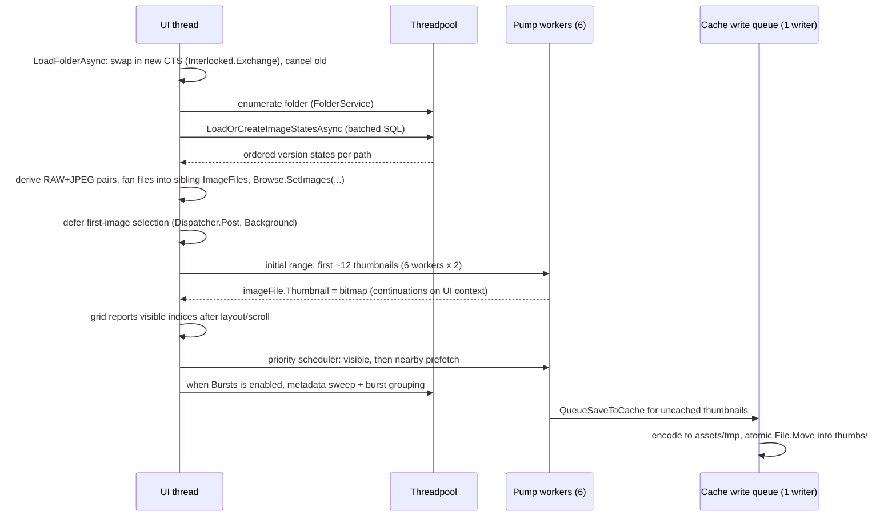

# Happy Photon Architecture

Happy Photon is a .NET 10/Avalonia photo workflow. This document owns startup,
catalog storage, folder loading and thumbnail scheduling. See [AGENTS.md](../AGENTS.md)
for repository rules and pipeline/OVERVIEW.md for decode/render invariants.

## Process shape

- One process, one window. `Program` acquires `SingleInstanceGuard` before Avalonia
  starts; a second launch exits immediately.
- `AppDataLocationService` owns every application-data root. The default
  catalog remains under Pictures, while regenerable assets use the platform
  cache location:

```
<Pictures>/Happy Photon Catalog/
├── catalog.db              SQLite: image metadata, edit settings, flags, ratings, app settings
├── .catalog-identity       versioned catalog instance GUID
└── presets/                user preset JSON files (PresetService)

<platform cache>/assets/
    ├── .catalog-stamp          catalog GUID + image-id high-water mark
    ├── thumbs/<xx>/<id>.jpg     largest unedited thumbnails, sharded by catalogId % 256
    ├── previews/<xx>/<id>.jpg   cached 1600px previews, same sharding
    ├── rendered-thumbs/<xx>/<id>.jpg  accurate edited RAW thumbnails + metadata sidecars
    └── tmp/                     staging for atomic cache writes; cleared at startup
```

Windows uses `%LOCALAPPDATA%\Happy Photon\cache`, Linux uses
`~/.cache/happy-photon`, and macOS uses `~/Library/Caches/Happy Photon`. The
fixed `locations.json` pointer lives in Local AppData on Windows,
`~/.config/happy-photon` on Linux, and Application Support on macOS. Users can
opt into the platform data root for the catalog. Environment overrides affect
one process and are never written to the pointer.

Every root carries `.happy-photon-root`; destructive operations recheck ownership
and touch only known catalog/cache data. Pointer-designated roots may regain a missing
marker on open, but foreign markers refuse. Existing Pictures catalogs with assets
adopt the legacy co-located layout; without assets, adoption restores split storage.

## Layering (MVVM)

| Layer | Location | Rules |
|---|---|---|
| Models | `Models/` | Plain data + `ObservableObject` state (`ImageFile`, `EditSettings`, …). No I/O. |
| Services | `Services/` | All image/catalog/file logic. Flat folder, focused class names, no UI types except `Avalonia.Media.Imaging.Bitmap` as an output format. |
| ViewModels | `ViewModels/` | `MainWindowViewModel` split into partial files per workflow (`.BrowseLoading`, `.Editing`, `.Folders`, …). Owns commands, debouncing, cancellation. |
| Views | `Views/` | XAML + minimal code-behind (dialogs, pointer handling, panel wiring). |

Key service composition (`ImageService` is a facade, constructed lazily on first use):

```
MainWindowViewModel
 ├── CatalogService                       SQLite runtime ops; CatalogSchema owns DDL/shape validation
 ├── ImageService (facade)
 │    ├── ThumbnailService ── ThumbnailCacheService (unedited source cache)
 │    ├── PreviewService ──── PreviewCacheService + RenderedThumbnailCacheService
 │    │    └── PreviewBaseCoordinator ── BaseLoaderRouter
 │    ├── HistogramService
 │    ├── MetadataService                           (single-flight extraction + UI apply)
 │    ├── SourceAvailabilityService + SourceHydrationService
 │    ├── RenderPipeline                            (shared preview/export edit math)
 │    ├── ImageExportService ── GatedBaseImageLoader + RenderPipeline
 │    │                         + ExportMetadataService
 │    └── IRawProcessingService                     (thumbnails + metadata only)
 ├── FolderService / FolderTreeService              (disk enumeration)
 ├── PresetService, AppSettingsService, FileOperationService
```

The facade exposes sub-services directly and retains only cross-service composition.

## Image pipeline

[pipeline/OVERVIEW.md](pipeline/OVERVIEW.md) owns the decode/render model and its
invariants. Preview, export and edited standard thumbnails share `RenderPipeline`;
RAW cache misses use embedded previews with geometry only. Linear, radial and brush locals
ship; layered compositing, HDR, custom output profiles, AVIF/JXL and native region
decode remain boundaries. The preview ownership summary appears below.

## Startup sequence

No non-visual initialization precedes the first frame. The bounded synchronous
`window.txt` read is visual configuration applied before Show to avoid a jump;
its plain key=value format avoids loading JSON. Failure preserves default placement.

1. `Program.Main`: single-instance guard, then Avalonia lifetime.
2. `App.OnFrameworkInitializationCompleted`: construct path-free services +
   `MainWindowViewModel`, show `MainWindow`, then post `CompleteStartupAsync` at
   `Background` dispatcher priority.
3. `CompleteStartupAsync` (off the first-frame path):
   - probe native RAW health on a worker thread, publish pending/degraded About state,
     and inject the completed immutable result into both RAW composition branches
     before workspace readiness; a rejection leaves RAW support unavailable until the
     installation is repaired;
   - finish or roll back a pending journaled move, then resolve `locations.json`;
   - branch on an existing catalog signature rather than a configured path. A fresh or
     configured-but-empty install renders the static Welcome step before any SQLite open;
   - after the user confirms Storage, create or claim the selected roots and re-enter
     initialization at the Pictures step. This committed checkpoint prevents root
     creation from running twice;
   - open the shared catalog connection;
   - create tables;
   - run ordered catalog migrations;
   - validate the resulting schema;
   - check and atomically refresh the cache/catalog pairing stamp;
   - bind `PresetService` to the resolved catalog and load user presets.
   - `MainWindow.InitializeApplicationAsync` — load app settings without treating read
     failures as an empty installation, then restore the session, grandfather an
     existing saved browsing root, or prepare an unselected Pictures tree for the
     versioned first-run wizard.

The first frame paints Dark; saved theme loads afterward and dynamic resources repaint
the realized tree. The appearance picker stays disabled until settings arrive.

The first-frame startup gate disables workspace controls/shortcuts until `Ready`.
Invalid/unreadable pointers, including missing catalog folders, require explicit
quarantine/recovery. Schema mismatch offers journaled **Set aside and retry** for both
roots unless environment-managed; other catalog/settings failures offer Retry/Close.
Incomplete first-run shutdown saves preferences only; browsing root, viewed folder and
completion version commit together when the wizard finishes. DESIGN.md owns first-run,
Lightroom-discovery and tour presentation.

## The catalog

### Schema

`images` has one row per case-insensitive `(file_path, version)`, versions 1–8, keyed by
autoincrement `id` (**catalogId**). It stores optional `version_label`, `file_name`, v4
`edit_settings` JSON, `edit_version`, `flag_state`, `rating`, `color_label`,
`history_position`, and `updated_utc`. Each row owns edits, history, and assessments
while sharing the source. `edit_history` stores full labeled snapshots by `(image_id,
seq)`; `app_settings` stores key/value pairs.
`image_assessments` stores per-image `revision`, `assessed_utc`, and `pending_axes`
for conflict-aware XMP reconciliation and publication.

`CatalogSchema` creates new catalogs, runs ordered transactional migrations recorded in
`app_settings.schema_version`, then validates required image columns with `PRAGMA
table_info` at every startup. Migration 1 adds `color_label`; 2 adds
`image_assessments`; 3 backs up and rebuilds `images`, preserving IDs and their
autoincrement high-water mark as cache identity; 4 adds history without back-filling.
Extra columns are tolerated for development-build compatibility. Missing columns fail
startup; the error names them and offers to set aside the catalog/cache pair and Retry.
An ownership-checked journal resumes or rolls back crash-interrupted root renames.

### Location moves and cache identity

Settings stages moves for next launch before catalog open. Catalog moves recover any
hot journal, fingerprint catalog/presets, copy and verify, flip the location pointer,
then remove only known source data. Before the flip failure rolls back; afterward the
journal resumes cleanup. Cache moves rename same-volume assets or regenerate across
volumes, never copying caches across volumes.

The versioned `.catalog-identity` GUID and `assets/.catalog-stamp` prevent ID-sharded
assets from pairing with a different or rolled-back catalog. A missing stamp on a
nonempty established cache, a GUID mismatch, or an ID high-water regression clears
the known tiers. Legacy adoption receives one trusted bootstrap. The stamp advances
after each single insert or insert batch. A missing cache root self-heals; a missing
catalog root fails startup.

Matching version-3 rows migrate in memory; matching version-4 rows parse directly.
Out-of-range values clamp in memory. Null/malformed documents and unsupported or
mismatched markers log once and return neutral current settings. Reads never rewrite
rows; one corrupt row cannot fail the batched load. RENDER schema details live in
[pipeline/RENDER.md](pipeline/RENDER.md) §8.
Runtime cache validity uses asset timestamps, never DB flags.

### The batched-load invariant

**Folder loads never issue per-image queries.** `LoadOrCreateImageStatesAsync(paths)`
queries bounded path batches, bulk-inserts missing V1 rows, and requeries only after
inserts. `EnsureCatalogIdAsync` serves isolated images outside folder loads and no-ops
for existing IDs; query counts scale with batches, never per-image state.

### Write patterns

- **Edit autosave:** debounce commits one settings/history transaction per gesture,
  adding Original when needed. Crop and provisional Horizon commit together.
- **Batch paste:** clone proposals, write every target and history in one transaction,
  then update live models. A missing row rolls back the whole set.
- **Assessments:** one set-based transactional update; models change only after commit.
- **App settings:** multi-key saves are atomic, including first-run paths and completion.
- **Deletes:** asset files first, then rows.

### Connection serialization

`CatalogService` serializes one `SqliteConnection` with its own `SemaphoreSlim` through
reader/transaction disposal. SQLite async calls block, so folder loads use a worker.
Batches release the gate between statements for user work; composite methods cannot
reacquire this non-reentrant gate.

The ViewModel tracks accepted history reads/commits, including superseded subjects.
Shutdown stops new reads, finishes commits, then drains reads before catalog teardown.
Folder/history reads await earlier saves by case-insensitive source path; cancelling the
wait preserves the save and edits across instance replacement, without per-image
queries. One gated connection needs no WAL.

## Lightroom catalog import

`LightroomCatalogReader` reads assessments and optional crops from a closed-catalog
snapshot and refuses active sidecars: even read-only SQLite can mutate an existing WAL
shared-memory sidecar. Preview maps paths and checks existence without source-content
reads, skips missing files, and cannot persist settings with zero matches. Crop import
requires separate opt-in and only availability-gated, header-only EXIF orientation
reads; it never decodes or hydrates an original. Unsupported crops stay unchanged.
`CatalogService.Import` revalidates per-axis revision baselines under the connection
gate, writes rows/assessments/settings in one transaction, and merges crops only into
empty geometry while preserving tonal edits and adding history. Imported assessments
never set `pending_axes`, keeping large imports out of the bounded XMP writer. Live
models adopt committed snapshots only while their baseline revisions still match.

## XMP sidecars

XMP is opt-in per catalog. Parsing begins as cancellable background work after the
thumbnail session starts. Reconciliation compares axes against revisioned assessments;
catalog revisions and browse generation guard adoption. V1 alone exchanges sidecars.
Crop is fill-empty and recency-exempt, entering history only when live and stored
geometry are empty. WORKFLOW.md explains use.

Read/write publication coalesces changed axes, preserves unrelated XML, revalidates
path/timestamp/length, then atomically promotes a temporary sibling file. Standard
vocabulary only: `xmp:Rating` preserves true 0–5 stars; `xmpDM:pick` carries 1/0/−1;
`xmpDM:good` accompanies pick/reject; `xmp:Label=""` explicitly clears a label.
Portable crops use `crs:HasCrop`, normalized edges and `crs:CropAngle="0"`; other
Camera Raw properties remain untouched. No `happyphoton` namespace is written.
Angled, warp-relative and orientation-transposed crops are skipped. Both reader and
writer reject sidecars over 4 MiB and gate sidecar availability independently.
Crop interop may read an availability-gated EXIF orientation header, never decode or
hydrate the original. Reject-only `xmp:Rating="-1"` consumers cannot see our pick state.

## Folder load and the thumbnail pump

Folder switches do bounded UI work, prioritize visible thumbnails and cancel previous
work without leaking or double-disposing its token source.

### Sequence



### Cancellation ownership protocol

`LoadFolderAsync` atomically swaps and cancels the previous CTS. Before a thumbnail
session starts, the loader owns disposal; after transfer, the session owns it until
its workers finish. CompareExchange prevents old cleanup from clearing new state.
Folder generations reject late results; per-image generations also prevent an older
load from replacing a newer edited thumbnail or failure state. Rejected bitmaps and
resident bitmaps on replacement/removal/shutdown are disposed deterministically.

### The pump

The initial visible burst uses six workers sharing an index, staging Large requests
at Small quality before upgrade. One `ThumbnailLoadScheduler` then owns six long-lived
workers, a coalescing visible-first queue and bounded nearby prefetch.
Develop/fullscreen pause admission before preview work; admitted reads may finish,
while queued work resumes on return to Browse. Paused work is not status activity.

- Active-browse membership is checked in constant time. A terminal decode failure
  remains terminal for that folder instance; a reload permits retry.
- Hydration deferrals are distinct from failures and reserve no residency slot.
  Failed/deferred upgrades preserve a usable resident bitmap and do not repeatedly retry.
- Workers share one wake signal; there is no waiter or cancellation registration per
  image.
- RAW/JPEG pairing changes visibility without another catalog read and preserves its
  preference. Bursts groups logical captures, not duplicate representations.
- Bursts runs a cancellable metadata sweep only when enabled and groups after UI apply.
  It skips cloud-only sources; metadata is single-flight with selection-triggered loads.

Worker continuations apply thumbnails on the UI context. Visible/selected images are
pinned; unpinned least-recently-visible bitmaps retire before admission. The residency
budget counts actual BGRA bytes and pending retirement, with prefetch headroom.
The disk cache is the long-lived store; scrolling never retains the entire folder.

### Per-image thumbnail resolution (ThumbnailService)

Requests carry minimum-acceptable and generation sizes. Larger entries satisfy smaller
requests; undersized entries paint while upgrades queue safely. Largest-wins writes
prevent late Small work replacing Large output. DECODE.md §5 owns sizes/formats.

Cache-miss candidates are tried in order:

1. RAW LibRaw embedded preview, oriented and normalized for camera padding against
   the visible RAW aspect; missing geometry does not invalidate extracted bytes.
2. Header-only EXIF thumbnail, requiring source-matching geometry.
3. RAW embedded-JPEG byte scan, validating candidates and retaining the largest safe one.
4. Reduced standard-image decode: JPEG uses the platform decoder and orientation remap;
   other standard formats use Magick size hints. RAW never enters this step.

RAW extraction continues only until the generation target is met or safe candidates
are exhausted; Browse never demosaics RAW for a thumbnail. Edited standard images use
`RenderPipeline`. Edited RAWs prefer the accepted Develop thumbnail, then matching
rendered cache, then source preview with geometry only. The fallback never applies tone
or color to the camera JPEG, upscales a crop, or loads a base/1600px preview.

### Cloud-file source access

Enumeration captures a display-only availability hint without opening image content.
Every source access rechecks attributes through `ISourceAvailabilityService` because
providers may dehydrate files after enumeration.

Thumbnails, metadata, previews, Bursts and unconfirmed exports use
`SourceReadIntent.Background`: local/unknown sources pass; hydration returns a typed
deferral. Warm caches are checked first and remain usable. `GatedBaseImageLoader` wraps
default and injected loaders; metadata/path-based statistics gate their own reads.

Only two user actions grant `UserApprovedHydration`: **Download and open** for one
selected image, and the Export workspace after it reports the immutable job's exact
cloud-file count and logical size. Both paths recheck live availability.

### The cache write queue (ThumbnailCacheService)

A bounded drop-oldest channel decouples cache writes from rendering and owns/disposes
accepted, dropped or failed payloads. One writer encodes in `assets/tmp/`, checks
captured source mtime, then atomically moves into place; startup clears orphans.
Shutdown completes and drains the queue to a deadline, then cancels/drops remaining
work: regenerable writes must not block close.

### Why cache validity is file-timestamp based

A cache file newer than its source needs no catalog read or flag update. This avoids
a second truth that can drift, survives atomic-write crashes and self-heals after
source changes or deleted caches. DECODE.md §5 owns cache formats and queue capacities.

## Preview pipeline (Develop mode)

`PreviewService` owns one current preview pair with generation-matched source
analysis. Decodes are single-flight and newest-wins. The ViewModel owns one outcome
channel and atomically applies pixels and facts only for the matching image/surface
generation; rejection disposes artifacts and uncommitted promotion leases.
Resting renders are display-only; adjacent warming is cache-only speculation.

[DECODE.md](pipeline/DECODE.md) §4 and §5 own base leases and cache formats.
[RENDER.md](pipeline/RENDER.md) §11 owns accepted outcomes, resting work and promotion.
[OVERVIEW.md](pipeline/OVERVIEW.md) owns shared pipeline invariants.

### Background activity ownership

One bounded sampler reads worker-owned counters only during active epochs; overlapping
producer/cache-write phases account for pending writes. Batch analysis/export scopes
suppress redundant metadata presentation. Samples never enumerate folder/cache/export
lists or alter shared decode methods. Hysteresis avoids flashes; pipeline/UI.md §9 owns
the static status segment for sustained preparation.

## Threading model summary

| Work | Where it runs | Coordination |
|---|---|---|
| Folder enumeration, catalog batch load | Threadpool (`Task.Run`) | Folder-load CTS; explicit because Sqlite async APIs still block |
| Initial thumbnail decode | Threadpool, 6 workers | Shared `Interlocked` index; folder generation + CTS |
| Viewport thumbnail decode | Threadpool, 6 workers | Coalescing priority queue; folder generation + CTS |
| `ImageFile.Thumbnail` assignment | UI context (worker continuations) | — |
| Thumbnail cache writes | Dedicated writer task | Bounded channel, drop-oldest; 2 s shutdown drain |
| Rendered preview cache writes | Dedicated writer task | On image leave; JPEG + hash sidecar; bounded drop-oldest; atomic move; 2 s drain |
| Rendered RAW thumbnail writes | Dedicated writer task | Independent capacity-8 queue; q85 JPEG + versioned metadata; promotion or image leave |
| Metadata extraction | Threadpool | Per-`ImageFile` single-flight task; selection loads drain during ViewModel teardown |
| Metadata apply + burst grouping | UI thread | Demand-driven by Bursts; cancelled on disable or folder change |
| Preview base decode | Threadpool | One held base; single-flight by identity; newest-wins generation |
| RAW sensor histogram | Preview decode worker | One visible post-Unpack pass; installed with lease analysis; full/export skip it |
| Preview render | Threadpool | Clone lease from held base; latest render generation wins |
| Resting preview render | Threadpool, at most 2 managed workers | Parent interactive generation + decode key + resting serial; edit token cancels |
| Adjacent preview warm | Long-running background task, capacity one | Settled Develop or loupe paint; walks up to five neighbors ahead; cancel-and-drop replacement semantics; one encoded cache handoff, held until persisted |
| Display histogram + waveform | Render pipeline: frame-scaled managed workers bounded by rows and processor count; cached/adjacent-warm paint: at most 2 managed workers | Exact preview BGRA8 buffer; shared row-parallel accumulation; histogram ticks skip inactive waveform accumulation |
| Browse histogram | UI pixel copy, threadpool calculation | Independent source clone; bounded 150px scale; selection/thumbnail-generation checks |
| All catalog SQL | Caller's context | Service-owned gate around the shared connection |
| Develop-subject history load | Threadpool (`Task.Run`) | Subject generation; load publishes before a waiting edit append |
| Explicit source hydration | Threadpool stream read | Single image or confirmed export batch; cancellation is best effort |

## Design invariants (do not break)

1. Original image files are never modified; exports refuse targets colliding with any
   loaded original (`ExportSafety`).
2. Folder loads make a constant number of DB statements — no per-image query loops.
3. Folder switches do constant work on the UI thread; heavy work is cancelled, not
   awaited.
4. Cache validity is decided by asset-file timestamps, never by DB flags.
5. Thumbnail and preview cache writes are atomic (temp file + move) and shed load
   rather than block interactive work.
6. First frame ships before catalog/preset/folder initialization starts.
7. Decoded thumbnails are viewport-prioritized and capped; the full folder must not be
   retained in native bitmap memory.
8. Every source file stays under 500 lines.
9. Background work never hydrates a cloud-only original. Source reads enforce live
   availability; only a clearly scoped user action may use approved hydration intent.
10. Indeterminate indicators run only during represented startup/first-run work, never
    at rest or hidden; hidden animation keeps the compositor rendering. Sustained
    preview preparation uses the static status-bar segment (DESIGN.md).
11. Interactive preview ticks stay on the pre-derived 1600 base. Viewport-resolution
    work begins only after a current 1600 paint and never enters histogram/cache
    paths; the 3200 cap and current-image-only pair ownership bound its memory peak.
